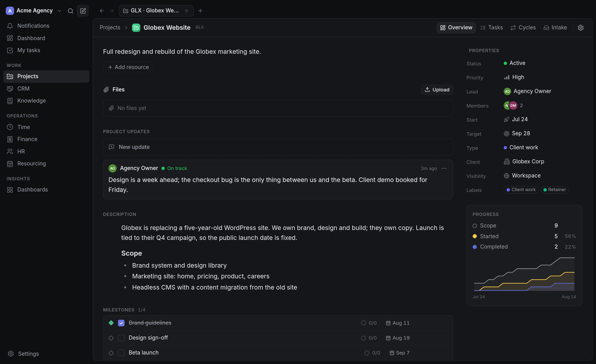
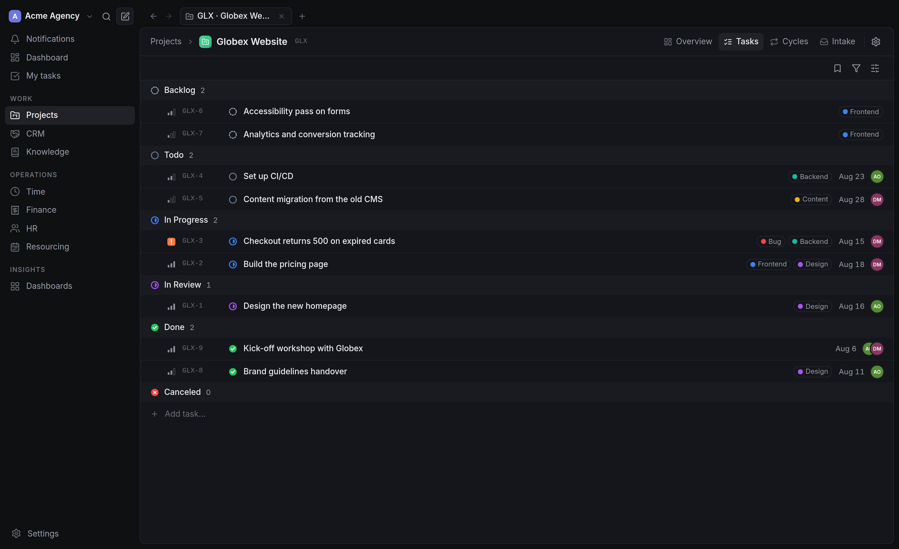
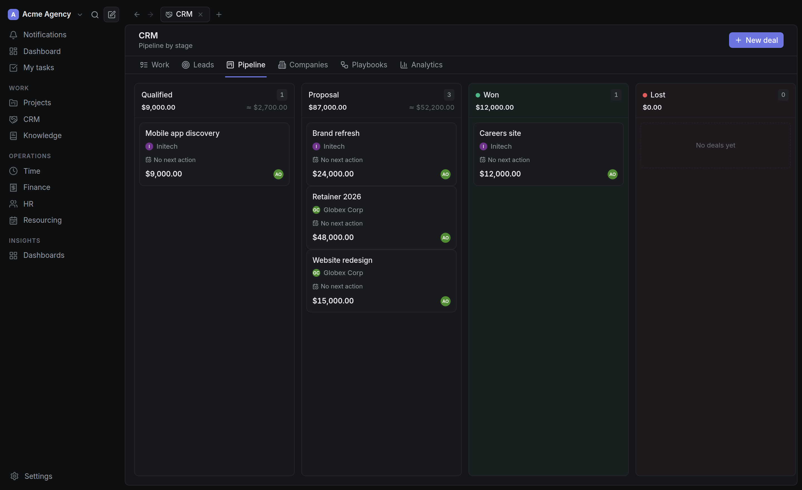
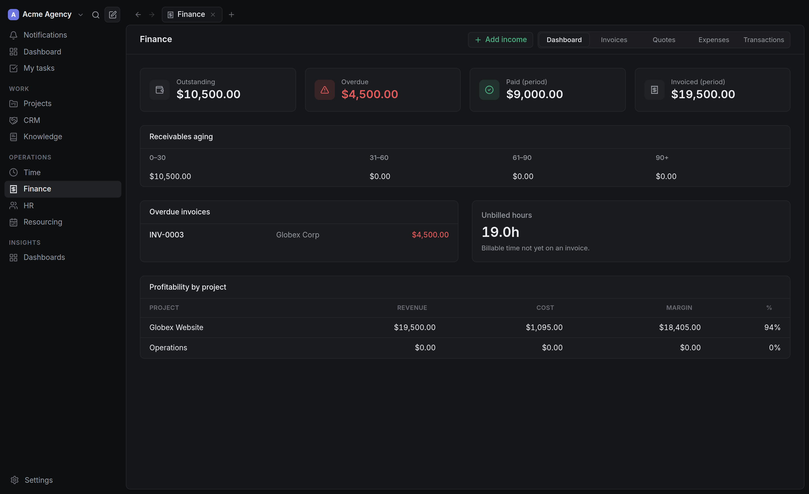

<div align="center">


# ordi

**The operations system for small agencies and product teams.**
Projects, CRM, knowledge base, time, finance and people – one app, one database, one API.

[](https://github.com/romirom11/ordi/actions/workflows/ci.yml)
[](LICENSE)
[](https://github.com/romirom11/ordi/releases/latest)

[Quick start](#quick-start) · [Why ordi](#why-ordi) · [Features](#features) · [Deploy](#deploy-it-for-real) · [Desktop app](https://github.com/romirom11/ordi/releases/latest)



</div>

---

## The problem

A ten-person agency ends up running on five subscriptions: Linear for tasks, a CRM
for the pipeline, Notion for documents, a timer app, and something for invoices.
Nothing knows about anything else. The hours logged against a task never reach the
invoice. The deal that became a project is retyped by hand. Nobody can answer
"did we make money on this client?" without a spreadsheet.

ordi is the other approach: one system where a deal becomes a project, the project's
tracked hours become an invoice, and the invoice posts to a real ledger – so the
margin on every project is a query, not an afternoon.

It is self-hosted, AGPL-licensed, and runs on one Postgres database.

## Why ordi

|  | ordi | Linear / Jira | Notion / ClickUp | Twenty / Odoo |
|---|---|---|---|---|
| Tasks with a real issue tracker feel | ✅ | ✅ | ⚠️ generic databases | ⚠️ basic |
| CRM with a pipeline | ✅ | ❌ | ⚠️ DIY | ✅ |
| Invoices, payments, double-entry ledger | ✅ | ❌ | ❌ | ✅ (heavy) |
| Time tracking tied to tasks and invoices | ✅ | ❌ | ⚠️ add-on | ⚠️ module |
| Knowledge base with permissions | ✅ | ❌ | ✅ | ❌ |
| HR: people, leave, compensation | ✅ | ❌ | ❌ | ✅ (heavy) |
| Project profitability out of the box | ✅ | ❌ | ❌ | ⚠️ configuration |
| Self-hosted, one database | ✅ | ❌ | ❌ | ✅ |
| Set up in an afternoon | ✅ | ✅ | ✅ | ❌ |

**Against Linear and Jira** – ordi's task experience is deliberately modelled on Linear:
keyboard-first, fast, opinionated. The difference is that the work connects to money.
A task carries hours, the hours carry rates, and the project tells you its margin.

**Against Notion and ClickUp** – those give you a toolkit and expect you to build the
system. ordi ships the system: real invoices with tax and payment terms, a real CRM
pipeline, real leave balances. Less freedom, far less setup.

**Against Odoo** – Odoo can do all of this and much more, after an implementation
project. ordi targets the ten-person agency that wants to be running today, not the
enterprise that needs manufacturing and payroll.

**Against Twenty** – Twenty is a beautiful open-source CRM. ordi is a CRM *and* the
delivery and finance system that follows the sale.

> Not for you if: you need manufacturing, inventory, payroll runs, or a hundred-seat
> deployment with SSO and custom workflow engines. ordi is built for teams of roughly
> 3 to 50 people.

## Features

<table>
<tr><td width="50%">

### Projects and tasks
Board, list, calendar, timeline and spreadsheet views. Cycles with burn-up,
milestones, project updates with health, saved views, filters and display options,
sub-tasks, dependencies, labels, custom fields.

</td><td width="50%">



</td></tr>
<tr><td width="50%">

### CRM
Companies, contacts, a drag-and-drop deal pipeline with weighted forecast, client
portal links, public intake forms and email intake over IMAP. A won deal turns into
a project without retyping anything.

</td><td width="50%">



</td></tr>
<tr><td width="50%">

### Finance
Quotes and invoices with tax, discounts, branded localized PDFs and public payment
pages. Payments, credit notes, recurring invoices and expenses. Underneath sits a
**double-entry ledger** – every invoice, payment and expense posts balanced entries,
so the books actually balance.

</td><td width="50%">



</td></tr>
</table>

### And the rest

- **Knowledge base** – Notion-style editor, spaces with per-space permissions, nested
  pages, versions, backlinks, publishing and Markdown export.
- **Time** – timers and manual entries against tasks, billable rates and cost rates,
  timesheet approval, invoice-from-time.
- **People** – employee records, org structure, leave with balances, versioned
  compensation with audited access, recruiting with public careers pages.
- **Resourcing and dashboards** – capacity planning and custom dashboard widgets.
- **Realtime** – assignments and mentions arrive over SSE with a toast and a sound.
  No refresh.
- **Rich text everywhere** – `@` to mention people, `#` to reference tasks, KB pages,
  companies and invoices.
- **Modules you can switch off** – run ordi as just a task tracker, or just a CRM.
- **Built-in MCP server** – point Claude or Cursor at your workspace; the agent gets
  exactly the permissions of its API token, nothing more.
- **Desktop app** – macOS, Windows and Linux, with native notifications, a global
  quick-add shortcut, signed auto-updates, and sign-in through your browser
  instead of retyping credentials. Downloadable from inside the web app.
- **English and Ukrainian**, dark and light.

## Quick start

Requires **Docker**. Nothing else.

```bash
git clone https://github.com/romirom11/ordi.git
cd ordi
docker compose up --build
```

Open <http://localhost:8080> and the setup wizard will create your workspace and
owner account.

<details>
<summary><b>Run from source instead</b> (Node 22, pnpm 10, PostgreSQL 16)</summary>

```bash
pnpm install
cp .env.example .env               # set DATABASE_URL

pnpm db:migrate                    # schema + triggers
pnpm db:seed                       # demo workspace (optional but recommended)

pnpm api:dev                       # http://localhost:3000
pnpm web:dev                       # http://localhost:5173
```

The seed creates a full demo agency – clients, a live project with a sprint,
invoices with ledger entries, logged time and a knowledge base – so you can judge
the product in a minute rather than staring at empty states.

Sign in as `owner@ordi.local` / `password123`.

</details>

## Deploy it for real

[`docs/deployment.md`](docs/deployment.md) covers a production deployment with
docker-compose or Dokploy: TLS, SMTP and DNS records, S3-compatible storage,
backups and health checks. [`docs/operations.md`](docs/operations.md) covers
backup/PITR targets, monitoring and the restore runbook.

The desktop app connects to your instance – download it from
[Releases](https://github.com/romirom11/ordi/releases/latest) and enter your URL on
first launch.

## How it is built

| Layer | Tech |
|---|---|
| Database | PostgreSQL 16 – JSONB, full-text search, triggers |
| API | Hono on Node 22, TypeScript, Zod-validated, OpenAPI at `/api/docs` |
| ORM | Drizzle with SQL migrations |
| Web | React 19, Vite, TanStack Query, Tailwind |
| Queue | pg-boss, on the same Postgres – no Redis |
| Desktop | Tauri 2 |
| Monorepo | pnpm workspaces + Turborepo |

```
apps/api         Hono API – domain modules and background workers
apps/web         React SPA (also the desktop UI)
apps/desktop     Tauri shell
packages/db      Drizzle schema, migrations, triggers
packages/shared  Zod schemas, permission catalog, pure calculations
packages/mcp     MCP server over the REST API
```

Design notes and the reasoning behind the bigger decisions live in
[`docs/architecture-decisions.md`](docs/architecture-decisions.md); the original
product spec is [`docs/prd.md`](docs/prd.md).

A few principles the codebase holds to: permissions are enforced on every request
and the UI only hides things; writes use optimistic locking with a `version` column;
audit diffs redact sensitive fields; migrations are additive and run as a separate
deploy step.

## Contributing

Issues and pull requests are welcome – see [CONTRIBUTING.md](CONTRIBUTING.md) for
the setup, the conventions and what makes a change easy to merge. Security reports
go through [SECURITY.md](SECURITY.md), not public issues.

## License

[AGPL-3.0](LICENSE). You can run ordi for your own company, modify it and
self-host it freely. If you offer a modified ordi to others over a network, the
AGPL requires you to publish your changes.
