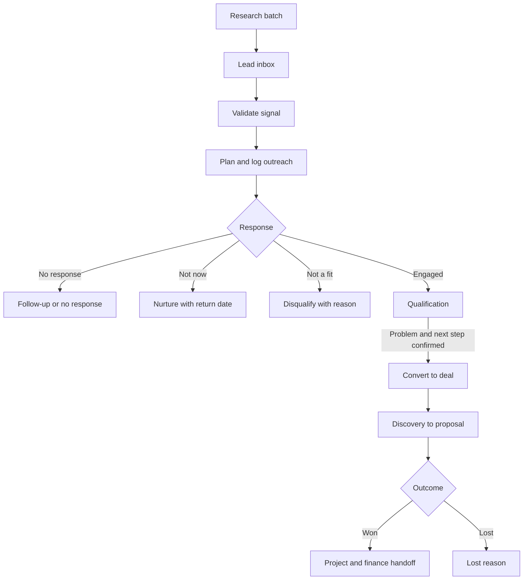
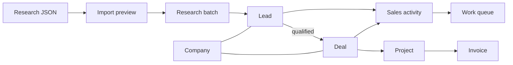

# CRM Sales Workspace - Plan

## Goal Capsule

- **Objective:** Turn CRM from a record repository into the working sales surface for research-driven outbound, qualification, opportunity management, and handoff into projects and finance.
- **Product authority:** This plan owns the CRM sales workflow across Work, Leads, Pipeline, and Companies while preserving the existing delivery and finance handoff.
- **Execution profile:** Implement additively on a feature branch with database, API, web, search, attachment, and MCP parity.
- **Stop conditions:** Stop before destructive data rewriting, outreach sending, or a change that makes an existing CRM route incompatible.
- **Open blockers:** None.
- **Tail ownership:** The implementation workflow owns tests, simplification, code review, and local commits; it must not push or open a PR without a later user request.

---

## Product Contract

### Summary

CRM will separate researched leads from qualified deals and make the next sales action the primary unit of work. The module will guide a lead from imported research through outreach and qualification into a deal, project, and invoice without losing context.

### Problem Frame

The current CRM stores companies, contacts, deals, notes, files, and audit activity, but it does not model day-to-day sales work. Research is placed in large notes and speculative opportunities enter the revenue pipeline before a prospect responds. Users cannot open CRM and see who needs attention, what happened last, or what must happen next.

### Key Decisions

- **Separate leads from deals** (session-settled: user-approved — chosen over treating every researched company as a deal: unverified prospects must not inflate or clutter the opportunity pipeline). Governs R3, R4, R11.
- **Make Work the default CRM surface** (session-settled: user-approved — chosen over opening on companies or the kanban: the primary user need is deciding what to do today). Governs R1, R6, R7.
- **Use first-class sales activities** (session-settled: user-approved — chosen over custom next-step fields and large notes: planned and completed actions need dates, outcomes, and history). Governs R5-R7.
- **Keep v1 manual-assisted** (session-settled: user-approved — chosen over automated sequences and channel integrations: reliable organization creates the immediate value without turning ordi into a marketing automation suite). Governs R17.
- **Evolve CRM additively.** Existing company, contact, deal, note, project, invoice, permission, and audit behavior remains compatible. Governs R15, R16, R18.

### Actors

- **Seller:** imports research, validates signals, contacts prospects, records outcomes, plans follow-ups, qualifies leads, and manages deals.
- **Research agent:** creates or imports structured research through the same authorized product capabilities available in the UI.
- **Prospect contact:** receives outreach and may reply, enter discovery, defer, or decline.
- **System:** maintains the work queue, activity history, conversion links, permissions, and downstream project/finance relationships.

### Requirements

**Module structure**

- R1. CRM must provide Work, Leads, Pipeline, and Companies as distinct surfaces, with Work as the default entry.
- R2. A company must remain the stable organization record across prospecting, sales, delivery, and finance, while the UI distinguishes prospects from established clients.
- R3. A lead must represent an unqualified sales pursuit for a product or service and link to a company, owner, and optional proposed contact.
- R4. A deal must represent a qualified commercial opportunity created only after the prospect confirms a relevant problem and agrees to a concrete next step.

**Activities and daily work**

- R5. Leads and deals must support planned, completed, and cancelled sales activities with type, owner, due date, outcome, and context.
- R6. Work must group actionable records into overdue, due today, waiting for reply, nurture due, and no-next-action queues.
- R7. Completing or logging an activity must preserve the event in history and allow the seller to schedule the next action without leaving the workflow.

**Lead handling**

- R8. A lead must preserve structured research including signal, fit, timing, score, source links, revalidation date, suggested channel, opener, caution, and the original research context.
- R9. The lead lifecycle must cover new, needs review, ready to contact, waiting for reply, engaged, nurture, qualified/converted, disqualified, and no response.
- R10. Lead detail must emphasize the next action, outreach controls, qualification state, structured research, and chronological sales history rather than a single large note.
- R11. Converting a qualified lead must create a linked deal while preserving its company, contact, research, notes, files, activity history, owner, and next action.

**Pipeline and company context**

- R12. Pipeline must contain qualified deals only, keep deal stages configurable, prioritize cards by activity urgency, and allow deal value to remain unknown until commercially grounded.
- R13. Company detail must aggregate contacts, leads, deals, projects, invoices, files, notes, and shared history without treating every company as an existing client.

**Research ingestion and agent parity**

- R14. Users must be able to preview and import the provided research JSON with duplicate matching, active-prospect creation, field mapping, and retained exclusion reasons without creating active company records for exclusions.
- R15. Every new lead, activity, conversion, and due-work action available in the UI must also be available to an authorized agent through the existing API/MCP permission model.

**Compatibility and governance**

- R16. The change must preserve existing CRM data and current company, contact, deal, note, file, project, invoice, search, audit, and MCP contracts unless an additive extension is required.
- R17. Existing open deals in a legacy Lead stage must remain accessible and be reviewable for one-click retention as a deal or demotion into a lead without losing context.
- R18. Lead and activity reads and writes must follow the existing CRM/deals permissions, optimistic concurrency, audit, soft-deletion, search, and event conventions.
- R19. New user-facing CRM behavior must support both English and Ukrainian.

**v1 operating boundary**

- R20. v1 must assist manual outreach with copy/open/log controls and follow-up scheduling, but must not send messages or automate outreach sequences.

### Key Flows

- **F1. Import research**
  - **Trigger:** The seller pastes or uploads the supplied shortlist JSON.
  - **Steps:** Preview matches and exclusions; confirm import; create active leads and their first review activities.
  - **Outcome:** Lea Hough, JIG, and EMA enter Leads with structured context while excluded candidates remain reference history.
  - **Covered by:** R3, R8, R14, R15.

- **F2. Process daily work**
  - **Trigger:** The seller opens CRM.
  - **Steps:** Work shows due items; the seller completes an action; the result is logged; a follow-up or terminal outcome is selected.
  - **Outcome:** No active pursuit disappears because its next action lives only in a note.
  - **Covered by:** R5-R7.

- **F3. Qualify and convert**
  - **Trigger:** A prospect replies and agrees to discuss a relevant workflow.
  - **Steps:** Record the reply; capture qualification evidence; convert to a deal; retain context and schedule the discovery action.
  - **Outcome:** The revenue pipeline begins with a grounded opportunity rather than a research hypothesis.
  - **Covered by:** R4, R9-R12.

- **F4. Review legacy records**
  - **Trigger:** The deployment contains deals in the legacy Lead stage.
  - **Steps:** Surface them for review; keep qualified opportunities in Pipeline or demote unqualified records to Leads.
  - **Outcome:** Existing data remains accessible and no speculative pipeline value is silently reclassified.
  - **Covered by:** R16, R17.

### Acceptance Examples

- **AE1 — Imported prospect:** Given the supplied research JSON, when the seller confirms import, then three active leads are created or matched to companies, the excluded candidates do not clutter Companies, and each active lead has a review action.
- **AE2 — Outreach and follow-up:** Given a ready lead, when the seller logs a LinkedIn message, then the event appears in history, the lead enters waiting-for-reply, and a dated follow-up can be scheduled in the same flow.
- **AE3 — No hidden work:** Given an active lead or deal with no planned activity, when CRM Work loads, then the record appears under no next action.
- **AE4 — Qualified conversion:** Given an engaged lead with confirmed pain and an agreed discovery call, when it is converted, then a linked deal starts in the configured first opportunity stage and retains its research, contact, history, owner, and next action.
- **AE5 — Unknown value:** Given a newly converted deal with no agreed price, when Pipeline renders, then the deal remains visible without contributing a fabricated amount to forecast totals.
- **AE6 — Nurture:** Given a prospect that is relevant but not ready, when the seller selects nurture and a return date, then it leaves active outreach queues and reappears when due.
- **AE7 — Legacy compatibility:** Given an existing deal, note, company, or integration created before the feature, when the release is deployed, then the record remains readable and editable through its existing contract.

### Success Criteria

- Opening CRM tells the seller what to do next without reading pinned research notes.
- The supplied shortlist can be imported and processed without manually reconstructing each record.
- Active leads and deals are measurable by due work, reply, qualification, and conversion rather than only forecast value.
- Qualified lead conversion preserves history and continues into the existing project and finance workflow.
- Existing CRM tests and public contracts remain green alongside new workflow coverage.

### Scope Boundaries

**Deferred for later**

- Gmail or Outlook synchronization.
- LinkedIn or email sending integrations.
- Automated outreach sequences and templates beyond copy/log assistance.
- Advanced funnel analytics and forecasting reports.
- Automated scoring, enrichment, and source revalidation.

**Outside this product's identity**

- Scraping private contact data.
- Autonomous bulk outreach or AI-generated spam.
- A generic workflow automation builder for sales.
- Marketing campaign management.

### Dependencies / Assumptions

- The existing company, contact, deal, note, activity audit, attachment, project, finance, permission, search, event, and MCP foundations remain authoritative.
- The primary workflow is low-volume, research-driven B2B outbound for a small agency, so an opinionated manual-assisted process is preferred over enterprise configurability.
- Unknown deal value is valid and must not be coerced into speculative forecast revenue.

### Sources / Research

- `README.md:24` — product thesis connecting CRM, delivery, and finance.
- `docs/prd.md:331` — current CRM product contract.
- `docs/features.md:30` — scope of the prior CRM rework.
- `packages/db/src/schema/crm.ts:5` — current CRM persistence.
- `packages/shared/src/schemas/crm.ts:38` — current deal write contract.
- `apps/web/src/pages/DealDetail.tsx:1` — current deal-detail composition.
- `apps/web/src/components/crm/PipelineTab.tsx:1` — current pipeline behavior.
- `apps/api/src/seed-baseline.ts:50` — default deal stages.

---

## Planning Contract

### Key Technical Decisions

- KTD1. Add `leads`, `research_batches`, and `sales_activities` tables while retaining companies, contacts, deals, notes, and audit activity as existing authorities. Governs R2-R11, R16-R18.
- KTD2. Link each sales activity to exactly one lead or deal and denormalize company/contact references for efficient Work queries. Governs R5-R7, R11-R13.
- KTD3. Store structured research in typed lead columns and retain the complete import payload plus exclusions on a research batch for traceability. Governs R8, R14.
- KTD4. Convert leads and demote legacy deals inside database transactions that reparent notes, attachments, and sales activities while retaining an explicit source link. Governs R11, R16, R17.
- KTD5. Make deal amount nullable; existing numeric amounts remain unchanged and pipeline totals ignore unknown values. Governs R12, R16.
- KTD6. Reuse `crm.read`/`crm.write` for leads, require both CRM and deal permissions for cross-boundary conversion/demotion, and keep deal activity visibility behind `deals.read`. Governs R15, R18.
- KTD7. Keep outreach manual-assisted: the application may copy text, open a public URL, and log the action, but no backend sends messages. Governs R10, R20.

### High-Level Technical Design

The API remains mounted under `/api/v1`. Lead and sales-work routes live in the existing CRM domain, and UI queries follow the established React Query helpers. Conversion and demotion are explicit commands rather than generic patches because they coordinate several records atomically.

### State and Compatibility Rules

- Lead statuses are `new`, `needs_review`, `ready`, `waiting_reply`, `engaged`, `nurture`, `converted`, `disqualified`, and `no_response`.
- Activity statuses are `planned`, `completed`, and `cancelled`; types are extensible text values with common UI presets.
- Work queue membership is derived in bounded SQL from active leads/deals and their earliest planned activity. It defaults to the current owner with an explicit team scope. `waiting_reply` is a lead state, while overdue/today/nurture/no-next-action are derived views; nurture return dates take precedence over activity timing.
- Existing deals in a stage named `Lead` remain deals until the user chooses demotion.
- Existing deal amounts and API payloads remain readable. Create and update payloads accept omitted or null amounts.
- Existing company status values remain valid; the UI labels a company as a client only when its lifecycle supports that interpretation.

### System-Wide Impact

- **Database:** additive tables, indexes, source links, `notes.lead_id`, and nullable deal amount.
- **API:** new lead/import/activity/work/conversion commands with audit events and optimistic locking.
- **Web:** new default CRM navigation, lead list/detail, Work queue, research import, and activity controls on lead/deal/company surfaces.
- **Search and files:** lead results and lead attachment authorization.
- **Agents:** MCP capabilities mirror lead, activity, work, import, and conversion actions.
- **Localization:** all new labels ship in English and Ukrainian.

### Risks and Mitigations

- **Migration risk:** use an additive Drizzle migration and verify existing deal CRUD after migration.
- **Context loss:** conversion and demotion run transactionally and have integration tests for notes, files, and activities.
- **Permission leakage:** cross-boundary routes require all relevant permissions; list routes filter by their owning permission.
- **Forecast regression:** nullable values are handled explicitly in totals, forms, and serializers.
- **Import duplication:** preview and commit share the same normalized company/domain matching logic.

### Sequencing

Implement persistence and shared contracts first, then API behavior, then web surfaces, then MCP/search parity. Existing CRM compatibility and end-to-end verification close the work.

---

## Implementation Units

### U1. Add the sales data model and shared contracts

- **Goal:** Establish additive persistence and validated public input shapes.
- **Requirements:** R3, R5, R8, R12, R14, R16, R18.
- **Dependencies:** None.
- **Files:** `packages/db/src/schema/crm.ts`, `packages/db/drizzle/*`, `packages/shared/src/schemas/crm.ts`, `packages/shared/src/index.ts`, `apps/api/src/test/helpers.ts`.
- **Approach:** Add lead, research-batch, and sales-activity tables plus source links and indexes; extend notes with `leadId`; make deal amount nullable; generate one forward migration.
- **Test scenarios:** Existing numeric deals remain valid; a deal may have an unknown value; lead score/status and activity parent validation reject invalid input; migration contains no destructive table or row removal.
- **Verification:** `pnpm --filter @ordi/db typecheck` and `pnpm --filter @ordi/shared typecheck`.

### U2. Implement lead, research import, and activity APIs

- **Goal:** Make researched prospects and their work lifecycle first-class.
- **Requirements:** R3, R5-R10, R14, R18-R20.
- **Dependencies:** U1.
- **Files:** `apps/api/src/domains/crm/routes.ts`, `apps/api/src/domains/crm/service.ts`, `apps/api/src/test/crm-sales-workspace.test.ts`.
- **Approach:** Add CRUD/list routes, import preview/commit, activity schedule/complete/cancel, and derived Work queues using existing auth, locking, audit, soft-delete, and event patterns.
- **Test scenarios:** Import preview detects company/lead matches and retains exclusions; commit is idempotent for the same batch; completing outreach updates history/status and can schedule a follow-up; overdue/today/waiting/nurture/no-action queues classify correctly; unauthorized writes fail.
- **Verification:** `pnpm --filter @ordi/api test -- crm-sales-workspace.test.ts`.

### U3. Implement safe conversion and legacy demotion

- **Goal:** Move pursuits across the lead/deal boundary without losing context.
- **Requirements:** R4, R11, R12, R16, R17.
- **Dependencies:** U1, U2.
- **Files:** `apps/api/src/domains/crm/routes.ts`, `apps/api/src/domains/crm/service.ts`, `apps/api/src/test/crm-sales-workspace.test.ts`.
- **Approach:** Add transactional `convert` and `demote-to-lead` commands, source links, planned-action continuity, and reparenting for notes, attachments, and activities.
- **Test scenarios:** Conversion preserves owner/company/contact/research and unknown amount; related records move once; retry cannot create a second deal; demotion soft-deletes only the legacy deal and retains its context; existing deal CRUD still passes.
- **Verification:** `pnpm --filter @ordi/api test -- crm-sales-workspace.test.ts crm.test.ts`.

### U4. Build Work, Leads, import, and lead detail surfaces

- **Goal:** Make CRM immediately actionable when opened.
- **Requirements:** R1, R6-R10, R14, R19, R20.
- **Dependencies:** U2, U3.
- **Files:** `apps/web/src/pages/Crm.tsx`, `apps/web/src/pages/LeadDetail.tsx`, `apps/web/src/routes.tsx`, `apps/web/src/components/crm/WorkTab.tsx`, `apps/web/src/components/crm/LeadsTab.tsx`, `apps/web/src/components/crm/SalesActivityPanel.tsx`, `apps/web/src/components/crm/ResearchImportDialog.tsx`, `apps/web/src/components/crm/shared.tsx`.
- **Approach:** Make Work the canonical CRM route, retain legacy tab aliases, add queue/list/detail views, structured research blocks, copy/open/log controls, and same-flow next-action scheduling.
- **Test scenarios:** `/crm` opens Work; imported leads are readable without a long note; a seller can log outreach and schedule follow-up; empty/loading/error states are clear; English and Ukrainian labels render.
- **Verification:** `pnpm --filter @ordi/web typecheck` and `pnpm --filter @ordi/web build`.

### U5. Integrate the workflow into Pipeline and Company detail

- **Goal:** Keep qualified opportunity and organization views coherent with the new model.
- **Requirements:** R2, R12, R13, R16, R17, R19.
- **Dependencies:** U3, U4.
- **Files:** `apps/web/src/components/crm/PipelineTab.tsx`, `apps/web/src/pages/DealDetail.tsx`, `apps/web/src/pages/CompanyDetail.tsx`, `apps/web/src/components/crm/dialogs.tsx`, `apps/web/src/components/crm/shared.tsx`.
- **Approach:** Show activity urgency on deals, handle unknown amounts, add deal activity controls and legacy demotion, and aggregate leads on Company detail without relabeling every company as a client.
- **Test scenarios:** Unknown values do not enter totals; deals with overdue actions sort ahead; company pages expose leads and deals; a legacy Lead-stage deal can be retained or demoted.
- **Verification:** `pnpm --filter @ordi/web typecheck` and focused browser inspection of CRM navigation, lead detail, deal detail, and company detail.

### U6. Add search, file, OpenAPI, and MCP parity

- **Goal:** Expose the same workflow safely to every supported interface.
- **Requirements:** R11, R15, R16, R18.
- **Dependencies:** U2, U3.
- **Files:** `apps/api/src/domains/core/search.routes.ts`, `apps/api/src/domains/core/attachments.routes.ts`, `apps/api/src/domains/core/openapi.ts`, `packages/mcp/src/server.ts`, `packages/mcp/src/server.test.ts`, `apps/web/src/components/settings/McpPanel.tsx`.
- **Approach:** Add lead search/attachment authorization and MCP tools for list/create/update/import/work/activity/convert using existing tool-call conventions and permission scopes.
- **Test scenarios:** Lead search respects `crm.read`; lead files follow CRM permissions; MCP tools return structured errors for missing permissions and mirror successful API behavior.
- **Verification:** `pnpm --filter @ordi/mcp test` and relevant API tests.

### U7. Verify compatibility and finish the product slice

- **Goal:** Prove the module is safe to merge and remove implementation debris.
- **Requirements:** R1-R20.
- **Dependencies:** U1-U6.
- **Files:** `docs/features.md` plus any test files strengthened during verification.
- **Approach:** Run the full quality gates, document the CRM workflow, inspect the migration, perform browser smoke testing, simplify the diff, and run structured code review.
- **Test scenarios:** Existing CRM/project/file flows remain green; the supplied shortlist can traverse import to Work to conversion; no UI or MCP action sends outreach.
- **Verification:** Use the complete Verification Contract below.

---

## Verification Contract

- **Focused database/contracts:** `pnpm --filter @ordi/db typecheck && pnpm --filter @ordi/shared typecheck`.
- **Focused API:** `pnpm --filter @ordi/api test -- crm-sales-workspace.test.ts crm.test.ts crm-agent-loop.test.ts`.
- **Focused MCP:** `pnpm --filter @ordi/mcp test`.
- **Web:** `pnpm --filter @ordi/web typecheck && pnpm --filter @ordi/web build`.
- **Repository gates:** `pnpm typecheck`, `pnpm test`, `pnpm build`, `pnpm check:query-shapes`, and `pnpm check:desktop-safe`.
- **Migration review:** inspect the generated SQL for additive tables/columns/indexes and the intentional `deals.amount` nullability change only.
- **Behavioral smoke test:** import a small research batch, process a due action, convert one qualified lead, verify its deal/company history, and demote one legacy Lead-stage deal.
- **Quality tail:** run the repository simplification and code-review skills; fix eligible findings and record any residual risk.

---

## Definition of Done

- Every R-ID is implemented or explicitly deferred by its owning scope boundary.
- Every U-ID has an observed verification result.
- Existing company, contact, deal, note, attachment, project, and finance data contracts remain readable.
- Research import, Work queues, activity lifecycle, conversion, and demotion have API integration coverage.
- Work, Leads, Pipeline, Companies, lead detail, deal detail, and company detail form one coherent English/Ukrainian workflow.
- UI and MCP capabilities have permission-equivalent API backing.
- The generated migration contains no unintended destructive operation.
- Required repository gates pass, or an external environment failure is documented with focused checks still passing.
- Simplification and code review are complete, eligible findings are resolved, and abandoned experimental code is removed from the diff.
