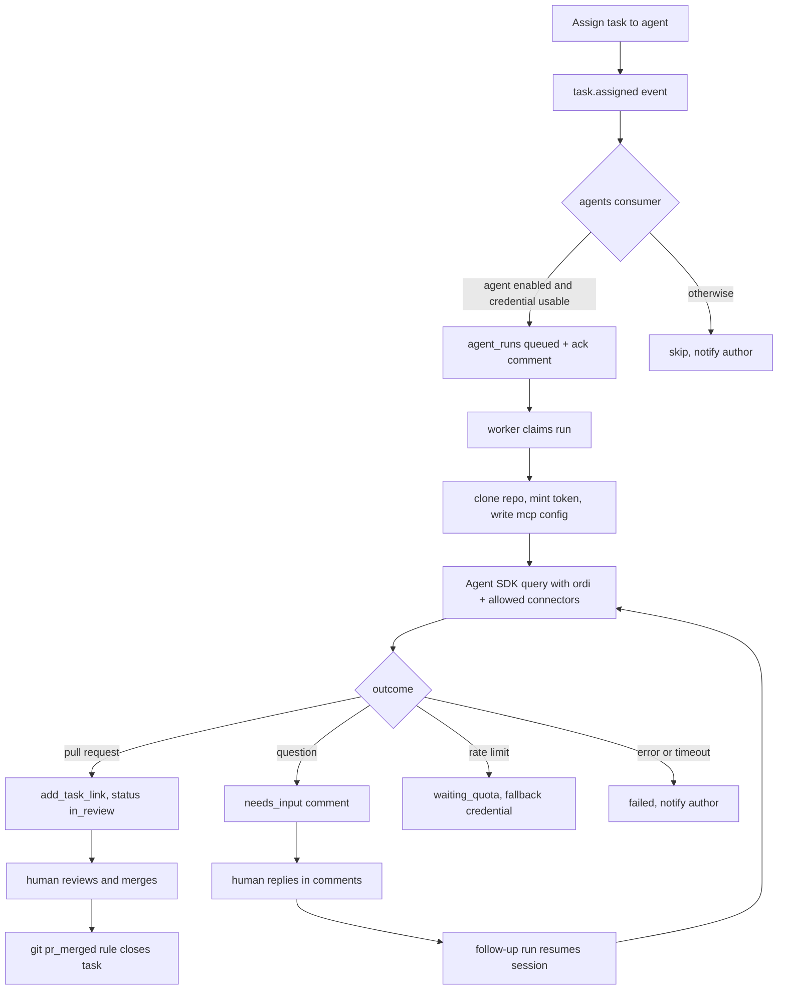
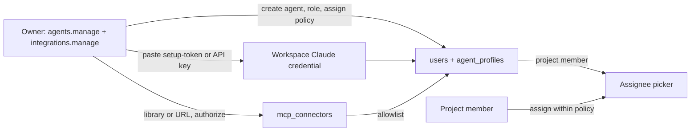

# AI Agent Employees - Plan

## Goal Capsule

- **Objective:** Let a workspace add an AI agent as a team member, assign it tasks like any other assignee, and have the platform run Claude Code against the task until a pull request is ready for human review.
- **Product authority:** This plan owns agent identity, provider credentials, the workspace MCP connector library, run dispatch and the task feedback loop. It does not change how humans work with tasks, git links, or permissions.
- **Execution profile:** Implement additively on a feature branch with database, API, worker, Docker image, web, and documentation parity. Claude Code is the only runtime that executes; Codex is registered but shown as coming soon.
- **Stop conditions:** Stop before merging pull requests on the agent's behalf, before shipping any shared "workspace subscription" credential, before executing arbitrary stdio commands supplied by users, and before any change that lets an agent act outside its role and project membership.
- **Open blockers:** None.
- **Tail ownership:** The implementation workflow owns tests, simplification, code review, and local commits; it must not push or open a PR without a later user request.

---

## Product Contract

### Summary

An agent is a user with `actor_type = 'agent'`, a runtime, a provider credential, and a set of allowed MCP connectors. Assigning a task to it queues a run. A worker inside the ordi deployment clones the project's repository, launches Claude Code headless with the ordi MCP server and the agent's connectors, streams the log to the task page, and ends with a pull request and the task in review. Humans review and merge; the existing `pr_merged` git rule closes the task. Comments on the task continue the same Claude session.

### Problem Frame

ordi already says "agent-first": every human action is reachable over MCP within a token's scope, and the seed even ships an `Agent` user. What is missing is the loop. Nothing turns `task.assigned` into work, nothing knows which model runs the agent or whose plan pays for it, nothing tells the agent which external tools it may use, and nothing shows a manager what the agent did and why. Today the answer is "open Claude Code on your laptop and point it at ordi", which does not scale past one person.

### Key Decisions

- **Agents run inside the ordi deployment, not on user machines** (session-settled: user-approved — chosen over a self-hosted runner each person installs: the platform owns execution so an admin configures it once and every member can assign work). Governs R12-R16, R30-R33.
- **Claude Code first, Codex registered as coming soon** (session-settled: user-approved — chosen over shipping both adapters: one runtime end to end beats two half-finished ones; the runtime enum, UI selector and credential model keep room for Codex). Governs R2, R6.
- **Subscriptions are first-class credentials alongside API keys** (session-settled: user-approved — chosen over API keys only: many teams already pay for Claude Max; Claude Code documents `claude setup-token` for headless use). Governs R6-R11.
- **Claude is configured once at workspace level by whoever holds `agents.manage`** (session-settled: user-approved — chosen over each member connecting their own plan: the owner connects a subscription token or an API key in Settings, every agent draws on it, and the card records who connected it and when so the team knows whose plan it is). Governs R6-R11.
- **RBAC is the existing model plus one permission domain** (session-settled: reused from PRD §4 — a new `agents` domain with `agents.manage`, a preset `Agent` role for agent users, role ∩ token scope on every agent call, project membership as the resource boundary, and an assign policy per agent so spending a plan is a deliberate grant). Governs R3, R14, R34, R43-R52.
- **A workspace connector library with a per-agent allowlist** (session-settled: user-approved — chosen over ad-hoc MCP config per run: admins add connectors once, from a curated library or by URL, and grant them to specific agents). Governs R17-R24.
- **Claude runs through the Agent SDK, not the CLI** (session-settled: user-approved — chosen over spawning `claude -p`: the SDK bundles the runtime, yields typed messages with session id and usage, and exposes `canUseTool` and hooks for a programmatic policy; authentication and Anthropic's policy are identical for both). Governs R15, R25, R33-R35.
- **ordi performs MCP OAuth itself and fronts connectors with a gateway** (session-settled: user-approved — chosen over rejecting OAuth connectors because the SDK cannot run the browser flow headless: MCP authorization is standard OAuth 2.1 with discovery, dynamic registration and PKCE, the MCP SDK already in the API ships the client side, and a gateway keeps upstream secrets inside the API process while refreshing tokens mid-run). Governs R19, R22, R23, R38-R42.
- **The agent never closes a coding task itself** (session-settled: user-approved — chosen over letting the agent set Done: it leaves the task in an `in_review` status with a PR link; the existing `pr_merged` automation closes it after a human merges). Governs R28, R29.
- **Permissions stay role ∩ token scope plus project membership** (session-settled: reused from PRD §4 and §16 — no new permission model for agents). Governs R3, R14, R34.

### Actors

- **Workspace owner or admin (`agents.manage`, `integrations.manage`):** connects Claude for the workspace, curates MCP connectors, creates agents, grants them connectors and projects, and sets who may assign work to them.
- **Task author / reviewer:** assigns tasks to an agent, answers its questions in comments, reviews and merges the pull request.
- **Agent:** an `actor_type = 'agent'` user; reads and writes ordi through MCP with its own short-lived token, and edits code in a per-run checkout.
- **Agent worker:** the platform process that claims queued runs, prepares the workspace, launches Claude Code, streams events, and finalizes the run.
- **System:** outbox, notifications, git webhooks and status automations that already exist.

### Requirements

**Agent identity**

- R1. A workspace member with `users.manage` can create an agent from the same "Add member" dialog as a person by switching on "This is an AI agent". The agent is a `users` row with `actor_type = 'agent'`, no password, no invite email, and an `agent_profiles` row.
- R2. An agent profile has a runtime (`claude_code` executable now; `codex` visible in the selector, disabled, labelled coming soon), free-text instructions, a completion status category (`in_review` by default), `max_run_minutes`, `max_turns`, `max_budget_usd` (nullable), and `concurrency` (default 1).
- R3. An agent holds a role like any user and must be a project member to be assignable there; the assignee picker only offers agents that are members of the task's project.
- R4. Agents carry a visible badge wherever an avatar is rendered, and `GET /users/lookup` exposes `actorType` so the web app can render it.
- R5. Agents never appear in the People directory, leave, or compensation surfaces (existing behaviour, kept).

**Credentials**

- R6. `agent_credentials` are workspace resources: provider (`anthropic` now; `openai` reserved), kind (`api_key` or `subscription`), label, `connected_by` and `connected_at`, an AES-GCM encrypted secret, `expires_at`, `last_verified_at`, and status. Creating, rotating, and revoking them requires `agents.manage`; the secret is never returned after creation.
- R7. A subscription credential for Claude is the one-year OAuth token produced by `claude setup-token`; the owner runs the command on their own machine and pastes the token into Settings → Agents. Subscription and API key are equal choices in the form.
- R8. An API-key credential for Claude is an Anthropic API key. `ANTHROPIC_API_KEY` in the container env is accepted as a fallback source for API keys only, so a PaaS deployment can configure Claude without touching the UI.
- R9. The workspace has one primary Claude credential and optionally one fallback; an agent profile may override both. Revoking a credential stops dispatch for every agent that would use it, and those agents show "credential required". Deactivating the person who connected a credential leaves it in place and flags the card, because it is a workspace asset.
- R10. "Verify" runs a minimal SDK query with the credential and records `last_verified_at` or the error.
- R11. ordi notifies holders of `agents.manage` fourteen days before a subscription token expires and marks the credential expired afterwards.

**Dispatch and runs**

- R12. When `task.assigned` names an enabled agent with a usable credential, a new `agents` outbox consumer inserts an `agent_runs` row (`queued`, trigger `assigned`) and posts a comment from the agent acknowledging the task. `bulkUpdateTasks` must emit `task.assigned` so bulk assignment also dispatches.
- R13. At most one active run exists per task; a second assignment or comment while a run is active is coalesced into a follow-up after the run ends.
- R14. The agent worker is a worker inside the API process, enabled by `AGENT_WORKER_ENABLED` (default on). It claims runs with `FOR UPDATE SKIP LOCKED`, respects `AGENT_WORKER_CONCURRENCY` and per-agent `concurrency`, and writes a heartbeat so the UI can show worker status.
- R15. The API depends on `@anthropic-ai/claude-agent-sdk`, which bundles the native Claude Code runtime; the Docker image installs `git` and keeps the SDK's optional platform binaries (no `--omit=optional`), and the image build fails if the SDK cannot locate its executable.
- R16. A run that no worker claims within ten minutes notifies the task author; a run that exceeds `max_run_minutes` is killed and marked `failed` with the reason.

**Connectors**

- R17. `mcp_connectors` stores workspace-level MCP servers: name, slug, source (`library` or `custom`), transport (`http`, `sse`, `stdio`), url or command/args, encrypted headers and env, `library_key`, enabled flag, health fields, and a cached tool list.
- R18. `packages/shared` ships a curated `MCP_LIBRARY` catalogue (key, name, description, transport, url or pinned npm command, required secret fields, docs link). The first catalogue covers GitHub, Context7, Playwright, Sentry, Notion, Linear, Slack, Figma, and PostgreSQL; entries are data, not code.
- R19. An admin with `integrations.manage` adds a connector from the library (filling its required secrets) or by URL for HTTP/SSE servers. Auth modes are `none`, `bearer`, `headers`, and `oauth`. Custom `stdio` connectors are not accepted in this slice.
- R20. "Test" performs an MCP initialize plus `tools/list` against the connector, stores the tool names and count, and shows them on the connector card.
- R21. `agent_connectors` links agents to connectors; the agent profile shows the workspace connectors as a checklist. The built-in `ordi` connector is always present and cannot be unchecked.
- R22. At run time the worker passes the SDK an `mcpServers` map containing `ordi` plus one gateway entry per allowed connector, every entry pointing at the ordi connector gateway with the per-run token. The agent never receives an upstream url, header, command, or env. Nothing else is loaded (`strictMcpConfig`).
- R23. Upstream secrets, OAuth tokens, and stdio env never leave the API process: they are not written to the run directory, not passed to the SDK subprocess, and run events are scrubbed for any known secret value before storage.
- R24. Disabling or deleting a connector removes it from future runs immediately and makes the gateway refuse it for active runs.

**Connector OAuth and gateway**

- R38. When a URL connector answers 401 with protected-resource metadata, ordi runs the MCP OAuth 2.1 client flow itself: discover the authorization server, register a client dynamically with the callback `APP_URL/api/v1/mcp-connectors/oauth/callback` (or use admin-supplied client id and secret when the provider has no dynamic registration), send the admin to consent with PKCE, exchange the code, and store access and refresh tokens encrypted with their expiry and the authorizing user.
- R39. ordi refreshes connector tokens before expiry and on a 401 from upstream; a refresh failure marks the connector `needs_auth`, shows a "Re-authorize" action on its card, and excludes it from new runs.
- R40. `POST /api/v1/mcp-connectors/:slug/mcp` is a Streamable HTTP MCP endpoint that authenticates the per-run token, checks the agent's allowlist and the connector state, and forwards JSON-RPC to the upstream with the current credential. SSE upstreams are bridged, and library `stdio` connectors are spawned by the gateway for the lifetime of the run and bridged the same way, so the SDK only ever sees Streamable HTTP.
- R41. The gateway records every `tools/call` as an `agent_run_events` row (connector, tool, duration, ok or error) without arguments or results, so the run log shows which external tools the agent used.
- R42. The connector card shows who authorized it and when, because the agent acts on the upstream as that person.

**RBAC**

- R43. A new permission domain `agents` with one permission, `agents.manage`, joins the catalogue. Owner and Admin receive it automatically because they carry the whole catalogue; the migration backfills it into existing `owner` and `admin` role rows and nowhere else. Any custom role can be granted it in the role matrix.
- R44. `agents.manage` governs: connecting, rotating, and revoking Claude credentials; creating, editing, disabling, and deleting agents; setting an agent's role, limits, instructions, assign policy, projects, and connector allowlist; cancelling or retrying any run; and seeing the Agents settings tab at all.
- R45. `integrations.manage` governs the connector library: adding, testing, authorizing, re-authorizing, disabling, and deleting connectors. Granting a connector to an agent is `agents.manage`. Owner and Admin hold both by default.
- R46. A preset role `agent` ships in `roles.ts`: `projects.read`, `projects.write`, `kb.read`. It is the default role in the create-agent dialog, editable like every preset, and the owner may pick any other role for an agent.
- R47. Every agent call to ordi is authorized as role ∩ per-run token scope through the existing `effectivePermissions`, and the per-run token's scope is the agent's role permissions at run start. A role change applies to the next run.
- R48. Project membership is the resource boundary. An agent sees only projects where it is a member, `assertProject` applies to it as to any user, and the assignee picker offers an agent only inside its projects. Agents are added to projects through the same members UI as people.
- R49. Each agent profile carries an `assign_policy`: `project_members` (default), `project_admins`, or `agents_managers`. `createTask`, `updateTask`, and `bulkUpdateTasks` reject an assignment that violates it with a domain error the UI shows inline, so a run and the plan it spends are always a deliberate grant.
- R50. Run visibility follows the task: anyone who can view the task sees its runs and live log. Cancel and retry require task write on the project or `agents.manage`.
- R51. Every mutation in this feature writes `activity_log`: credential connected, rotated, revoked; agent created, updated, disabled; connector added, authorized, disabled; allowlist changed; run queued, started, finished, cancelled. Secrets never appear in diffs.
- R52. Settings tabs and actions without access are absent, not disabled, in line with PRD §17.1: Agents needs `agents.manage`, Connectors needs `integrations.manage`, and the agent toggle in the member dialog needs `users.manage` plus `agents.manage`.

**Task loop**

- R25. The run prompt contains the task ref, title, description as text, labels, comments so far, links and git links, the project key, the agent's instructions, and the rules of engagement: report progress with `comment_on_task`, attach the pull request with `add_task_link`, finish by moving the task to the configured completion category, and ask via comment when blocked. The rules go in `systemPrompt.append`; the task goes in the prompt.
- R26. The worker resolves the repository through `project_repositories`, clones it fresh into `/data/agent-work/<runId>` using the GitHub App installation token, checks out the branch from `GET /tasks/:id/branch-name`, and gives Claude Code the checkout as its working directory. Projects without a repository run in an empty scratch directory.
- R27. The worker mints a short-lived `api_tokens` row for the agent user at run start and revokes it at run end; the ordi MCP entry points at the local API with that token, so every write is attributed to the agent with `actor_type = 'agent'`.
- R28. On success the agent pushes its branch and opens a pull request with the installation token; the existing git webhook links the PR to the task, and the run records the PR url and a summary.
- R29. The agent moves the task to the project's status with the profile's completion category (`in_review` by default) and never to a `done` status in this slice.
- R30. A human comment on a task whose assignee is an agent, or an `@`-mention of the agent, queues a follow-up run (trigger `comment`) that resumes the previous Claude session with the SDK `resume` option and the new comment as the prompt.
- R31. A run that ends because Claude asked a question is marked `needs_input`; the question is a task comment, and the author is notified.
- R32. A run that fails on a provider rate limit is marked `waiting_quota`, retried when the window is expected to reset, and switched to the fallback credential when one is configured.
- R33. SDK messages are stored as run events as they stream (session id from the init message, assistant text and tool use, the result with usage and cost) and broadcast over SSE so the task page shows a live log, duration, turn count, and cost or token usage.

**Security**

- R34. The SDK subprocess receives a rebuilt `env`: `PATH`, `HOME` pointing at a per-run `CLAUDE_CONFIG_DIR`, the provider credential, MCP timeouts, and nothing else. `DATABASE_URL`, `ENCRYPTION_KEY`, `AUTH_SECRET`, S3 and SMTP settings never reach it.
- R35. The run uses `permissionMode: 'dontAsk'` with an explicit `allowedTools` list (file tools, Bash, and `mcp__*` for the configured servers), `disallowedTools` for destructive git and network commands, `maxTurns` from the profile and `maxBudgetUsd` for API-key credentials, plus a `PreToolUse` hook that logs every tool call as a run event. The plan documents the blast radius as the container plus the agent's ordi role plus repository write via the installation token.
- R36. `docker-compose.prod.yml` documents an optional split where the worker runs as its own service from the same image with `AGENT_WORKER_ENABLED=1` and the API with `0`; the split is documentation in this slice, not default.
- R37. The GitHub App manifest requests `contents: write` and `pull_requests: write`; the integrations panel explains that the org owner must accept the new permissions before agents can push.

### Key Flows





### Acceptance Examples

- **AE1 — Create an agent:** Given an admin in Settings → Users, when they add a member with "This is an AI agent", runtime Claude Code, and a credential, then a badged agent appears in the user list, has no password, is absent from People, and can be added to a project.
- **AE2 — Subscription credential:** Given an owner who ran `claude setup-token`, when they paste the token into Settings → Agents and click Verify, then the workspace credential shows verified, connected by them, with an expiry a year out, and every agent can be dispatched.
- **AE13 — Permission boundary:** Given a Manager without `agents.manage`, when they open Settings, then there is no Agents tab, and a direct call to create an agent or read a credential returns 403; given a Member in a project, when they assign a task to an agent whose policy is `project_admins`, then the assignment is rejected inline and no run is queued.
- **AE14 — Agent scope:** Given an agent with the preset `agent` role, when its run calls a finance MCP tool, then the call fails with `forbidden` naming the missing permission, and the task comment from the agent still succeeds.
- **AE3 — Dispatch:** Given a task in a project with a linked repository, when it is assigned to the agent, then within seconds the task shows an acknowledgement comment and a queued run, and the worker starts it.
- **AE4 — Pull request:** Given a running agent that finishes a fix, when the run completes, then the task has a git link to an open PR, sits in an `in_review` status, and the run card shows a summary and usage.
- **AE5 — Merge closes:** Given AE4, when a human merges the PR, then the existing automation moves the task to Done with `actor_type = 'integration'`, and the run stays untouched.
- **AE6 — Follow-up:** Given a task in review with an agent assignee, when the reviewer comments "also update the tests", then a follow-up run resumes the same session and pushes to the same branch.
- **AE7 — Connector allowlist:** Given a workspace with GitHub and Sentry connectors and an agent allowed only Sentry, when the agent runs, then the SDK receives `ordi` and `sentry` only, both through the gateway, and the gateway refuses a call to `github` with the run's token.
- **AE11 — OAuth connector:** Given an admin who adds a Notion MCP URL, when ordi detects the authorization challenge and the admin completes consent, then the connector shows "authorized by" the admin with the tool list, an agent granted it can call Notion tools during a run, and a token refresh during a long run is invisible to the agent.
- **AE12 — Lost authorization:** Given an OAuth connector whose refresh token was revoked upstream, when the next run starts, then the connector is excluded, its card shows "Re-authorize", and the run proceeds with the remaining connectors.
- **AE8 — Quota:** Given an agent on a subscription credential that hits its five-hour window, when the CLI reports the limit, then the run shows `waiting_quota`, switches to the fallback API key if configured, and otherwise retries later without spamming the author.
- **AE9 — Bulk assign:** Given three tasks selected in the list view, when they are bulk-assigned to the agent, then three runs are queued (serialised by the agent's concurrency).
- **AE10 — Codex placeholder:** Given the runtime selector, when the admin opens it, then Codex is visible, disabled, and labelled coming soon, and the API rejects `codex` with a validation error.

### Success Criteria

- A workspace can go from "no agent" to a merged agent PR using only Settings, the Add member dialog, and the assignee picker.
- Every agent action inside ordi is attributable in the activity log to the agent user.
- A manager can tell whose plan an agent consumes and how much each run cost or used.
- Admins can add a connector from the library in under a minute and see which tools it exposes before granting it.
- No provider or connector secret appears in run logs, task comments, or API responses.

### Scope Boundaries

**Deferred for later**

- Codex runtime execution (device-auth flow driven from the UI, `CODEX_HOME` persistence, `codex exec resume`).
- Cloud-hosted runtimes (Anthropic Managed Agents, Codex cloud) and a desktop-embedded runner.
- Agents that complete non-code tasks straight to a `done` status; this slice always stops at `in_review`.
- Tool-level allowlists inside a connector (`mcp__server__tool` granularity); this slice grants whole connectors.
- Custom `stdio` connectors (library stdio entries only in this slice).
- Exposing the connector gateway to human MCP clients (one workspace URL for Cursor or Claude Desktop); the gateway is built for agents first.
- Scheduled or recurring agent runs, and agents as reviewers of other agents' PRs.
- GitLab and Gitea checkouts (the credential plumbing exists; only GitHub App cloning is wired here).
- Running the worker as a separate container by default; this slice documents the split.

**Explicitly out of scope**

- Merging pull requests, deleting branches, or any irreversible git action by the agent.
- Per-agent token scopes narrower than the agent's role; the role is the single knob in this slice.

### Dependencies / Assumptions

- The Claude Agent SDK (TypeScript) bundles the runtime, accepts `mcpServers` with `type: 'http' | 'sse'` plus `headers` and stdio entries, supports `permissionMode`, `allowedTools`, `disallowedTools`, `maxTurns`, `maxBudgetUsd`, `resume`, `cwd`, `env`, `hooks`, `strictMcpConfig`. It does not run MCP OAuth flows headless: a server that needs authorization is reported as `needs-auth` and skipped. Verified against the SDK docs on 2026-09-05.
- Subscription credentials reach the SDK: the authentication docs state that credential environment variables "apply to the CLI and the surfaces that wrap it, including the VS Code extension, the Agent SDK, and GitHub Actions", list the Agent SDK among login paths, rank `CLAUDE_CODE_OAUTH_TOKEN` fifth in precedence, and say the `setup-token` token "authenticates with your Claude subscription and requires a Pro, Max, Team, or Enterprise plan" while "MCP servers you configure locally still work". `ANTHROPIC_API_KEY` outranks it, so the rebuilt env carries exactly one credential; bare mode ignores it, so bare mode is never used. ordi is self-hosted and offers no login or plan of its own: a member generates the token for their own subscription with the documented command and stores it on their own server, the same headless use the docs describe. API key and subscription are therefore equal options in the UI.
- The MCP authorization flow is OAuth 2.1 with protected-resource discovery, dynamic client registration and PKCE; `@modelcontextprotocol/sdk` 1.29 (already an API dependency) provides the client-side helpers.
- The GitHub App integration can mint installation tokens (`installationToken` in `integrations/github-app.ts`) and receives PR webhooks that populate `git_links`.
- The outbox relay, `email_deliveries` claim pattern, and SSE broadcaster are the reference implementations for dispatch, claiming, and live logs.
- The Node 22 slim base image can run the SDK's bundled Linux binary and install `git` without extra runtimes.

### Sources / Research

- [Claude Code authentication and `setup-token`](https://code.claude.com/docs/en/authentication.md)
- [Claude Agent SDK quickstart](https://code.claude.com/docs/en/agent-sdk/quickstart.md)
- [Claude Agent SDK TypeScript reference](https://code.claude.com/docs/en/agent-sdk/typescript.md)
- [Claude Agent SDK MCP](https://code.claude.com/docs/en/agent-sdk/mcp.md)
- [Claude Agent SDK permissions](https://code.claude.com/docs/en/agent-sdk/permissions.md)
- [Claude Code MCP configuration](https://code.claude.com/docs/en/mcp.md)
- [Codex authentication (deferred runtime)](https://learn.chatgpt.com/docs/auth.md)
- [Codex non-interactive mode (deferred runtime)](https://learn.chatgpt.com/docs/non-interactive-mode)
- PRD §3.3 (outbox), §4 (RBAC), §13 (git), §16 (MCP); `docs/architecture-decisions.md` §5 (events and workers).

---

## Planning Contract

### Key Technical Decisions

- KTD1. Keep `users.actor_type = 'agent'` as the identity flag and add `agent_profiles` (1:1), `agent_credentials`, `mcp_connectors`, `agent_connectors`, `agent_runs`, and `agent_run_events` as additive tables. Governs R1-R2, R6, R17, R21, R33.
- KTD2. Dispatch through a sixth outbox consumer named `agents` so queuing inherits retry, dedupe, and dead-letter behaviour; the worker claims with `FOR UPDATE SKIP LOCKED` exactly like `email_deliveries`. Governs R12-R14.
- KTD3. Model runtimes as adapters behind one interface (`prepare`, `run`, `resume`, `classifyFailure`); `claude-code.ts` wraps the Agent SDK `query()` and a `codex.ts` stub throws `runtime_unavailable`. Governs R2, R30, R32.
- KTD4. Per-run identity is a minted-and-revoked `api_tokens` row, never a stored long-lived token; the ordi MCP entry and every gateway entry target `http://localhost:<port>/api/v1/...` with that bearer. Governs R27, R40.
- KTD5. Secrets (credential secrets, connector headers, env, OAuth tokens) are AES-GCM blobs via `lib/crypto`, masked in every GET, and decrypted only inside the gateway. The provider credential is the one secret the worker hands to the SDK subprocess. Governs R6, R17, R23, R34.
- KTD9. The connector gateway is a Hono route that speaks Streamable HTTP towards the agent and uses `@modelcontextprotocol/sdk` client transports towards the upstream (Streamable HTTP, SSE, or a stdio process it spawns per run): it authenticates the run token, resolves the connector and its credential, forwards the JSON-RPC body, and returns the response. OAuth state lives in `mcp_connector_oauth` (client registration, tokens, expiry, authorizing user). Governs R22, R38-R42.
- KTD6. Connector library entries live in `packages/shared/src/mcp-library.ts` as typed data; the API validates custom connectors to `http`/`sse` only. Governs R18, R19.
- KTD7. Run events are rows, not files: `agent_run_events` with a sequence number, broadcast through the existing SSE broadcaster scoped to the task's project. Governs R33.
- KTD8. The completion status is resolved per project by category (`in_review`), falling back to the first non-done status when the project has none, and the agent never targets `done`. Governs R29.
- KTD10. RBAC reuses `guard()`, `effectivePermissions`, and `assertProject` unchanged: `agents.manage` is a catalogue entry plus a backfill migration modelled on `0033_people_read_documents.sql`, the `agent` preset is a `RoleSeed`, the per-run token scope is the role's permission list, and the assign policy is enforced in the task service next to the existing membership check. Governs R43-R52.

### High-Level Technical Design

```mermaid
flowchart LR
  UI[Settings: Agents / Credentials / Connectors] --> API[/api/v1/agents/*]
  Assign[PATCH /tasks/:id assigneeIds] --> Outbox[(events)]
  Outbox --> Consumer[agents consumer]
  Consumer --> Runs[(agent_runs)]
  Runs --> Worker[agent worker]
  Worker --> Git[GitHub App clone/push/PR]
  Worker --> Claude[Agent SDK query]
  Claude --> OrdiMCP[/api/v1/mcp with per-run token]
  Claude --> Gateway[/api/v1/mcp-connectors/:slug/mcp]
  Gateway --> Upstream[upstream MCP servers, OAuth or static auth]
  Worker --> Events[(agent_run_events)] --> SSE[/api/v1/stream]
  Git --> Webhook[git webhook] --> Links[(git_links)] --> Rule[pr_merged rule]
```

The API gains an `agents` domain under `apps/api/src/domains/agents/` with routes for profiles, credentials, connectors, the connector OAuth callback, the gateway, and runs. The worker lives in `apps/api/src/workers/agent-runs.ts` and is started from `workers/index.ts`. The Claude adapter calls the SDK roughly as below, with `CLAUDE_CONFIG_DIR` set to a per-run directory:

```ts
for await (const message of query({
  prompt,
  options: {
    cwd: workdir,
    env: rebuiltEnv,                       // credential + PATH + HOME only
    systemPrompt: { type: 'preset', preset: 'claude_code', append: rules },
    mcpServers,                            // ordi + one gateway entry per allowed connector
    strictMcpConfig: true,
    permissionMode: 'dontAsk',
    allowedTools, disallowedTools,
    maxTurns, maxBudgetUsd,
    resume: previousSessionId,
    hooks: { PreToolUse: [logToolUse] },
    abortController,
  },
})) { await recordEvent(run, message); }
```

### State and Compatibility Rules

- Run statuses are `queued`, `claimed`, `running`, `waiting_quota`, `needs_input`, `succeeded`, `failed`, and `cancelled`. Only `queued` runs are claimable; only `running` runs can be cancelled by a user.
- Run triggers are `assigned`, `comment`, `retry`, and `manual`.
- Credential statuses are `active`, `expired`, and `revoked`; only `active` credentials are dispatchable.
- Connector sources are `library` and `custom`; transports `http`, `sse`, and `stdio` (stdio only when `source = 'library'`); auth modes `none`, `bearer`, `headers`, `oauth`; connector states `active`, `needs_auth`, `disabled`.
- Existing `task.assigned` payloads are unchanged; the consumer reads `assigneeIds` and looks up actor types itself.
- Existing agent user from the seed keeps working: without an `agent_profiles` row it is simply never dispatched.
- Existing MCP tokens, OAuth clients, and the McpPanel remain as they are; agents use the same hosted endpoint.

### System-Wide Impact

- **Database:** seven additive tables (`mcp_connector_oauth` included), `users` unchanged, one forward migration.
- **API:** new `agents` domain including the connector OAuth client and gateway; `bulkUpdateTasks` emits `task.assigned`; `GET /users/lookup` returns `actorType`; GitHub App manifest asks for write scopes; new dependency `@anthropic-ai/claude-agent-sdk`.
- **Workers:** new `agents` consumer and `agent-runs` worker with heartbeat; `startWorkers` and `stopWorkers` wire them.
- **Docker:** `Dockerfile.api` installs `git` and keeps the SDK's optional platform binaries; a `/data/agent-work` volume is documented; prod compose documents the optional split.
- **Web:** Add member dialog toggle, Settings → Agents panel with Agents, Credentials, and Connectors tabs, avatar badge, task page run block, i18n in English and Ukrainian.
- **Shared:** Zod schemas for agents, credentials, connectors, and runs; `MCP_LIBRARY`; new permission domain `agents` with `agents.manage`; the `agent` preset role; new event types `agent.run_queued`, `agent.run_started`, `agent.run_finished`, `agent.needs_input`.
- **Docs:** PRD §16 addendum, architecture decision on platform-hosted agents, deployment notes for the image and volume.

### Risks and Mitigations

- **Blast radius of an unattended agent:** `dontAsk` with explicit allow and deny lists, rebuilt child env, per-run token, no `done` transitions, no merge; documented container split for production.
- **OAuth providers without dynamic registration:** the connector form accepts a pre-registered client id and secret; the gateway treats both paths the same after tokens exist.
- **Gateway as a bottleneck:** it is stateless per request and forwards bodies without buffering results into the database; only `tools/call` metadata is recorded.
- **Unattended spend:** the credential is a workspace asset, so the assign policy, per-agent limits, and the "connected by" label are what keep spending deliberate and attributable.
- **Permission drift:** a lint test asserts every new route declares a `guard`, and the RBAC tests cover `agents.manage`, `integrations.manage`, the agent role, and the assign policy.
- **Rate limits on subscriptions:** `waiting_quota` state with backoff and optional fallback credential.
- **Disk growth:** fresh clone per run plus deletion on finish; volume size documented in operations.
- **Secrets in logs:** scrub known secret values from every stored event before insert.
- **Duplicate runs:** unique partial index on `agent_runs(task_id) WHERE status IN ('queued','claimed','running','waiting_quota')`.
- **Bulk assignment silently ignored:** `bulkUpdateTasks` gains event emission with a regression test.
- **GitHub App permission bump:** the integrations panel shows a "re-accept permissions" state until the installation reports write scopes.

### Sequencing

Persist and share contracts first, then credentials and connectors (they are independent of dispatch), then the consumer and worker with the Claude adapter, then web surfaces, then Docker and docs. End-to-end verification with a seeded project and a real credential closes the work.

---

## Implementation Units

### U1. Add the agent data model and shared contracts

- **Goal:** Establish additive persistence and validated input shapes for agents, credentials, connectors, and runs.
- **Requirements:** R1, R2, R6, R17, R21, R33, R43, R46.
- **Dependencies:** None.
- **Files:** `packages/db/src/schema/agents.ts`, `packages/db/src/schema/index.ts`, `packages/db/drizzle/*`, `packages/shared/src/schemas/agents.ts`, `packages/shared/src/mcp-library.ts`, `packages/shared/src/permissions.ts`, `packages/shared/src/roles.ts`, `packages/shared/src/events.ts`, `packages/shared/src/index.ts`.
- **Approach:** Add `agent_profiles`, `agent_credentials`, `mcp_connectors`, `mcp_connector_oauth`, `agent_connectors`, `agent_runs`, `agent_run_events` with the partial unique index on active runs; add the `agents` permission domain with `agents.manage` and a backfill migration into `owner` and `admin`; add the `agent` preset role; add the four event types; define the library catalogue and Zod schemas with `runtime: z.enum(['claude_code'])`, a documented `codex` reservation, and `assign_policy`.
- **Test scenarios:** Migration is additive and backfills only owner and admin; schemas reject `codex`, custom `stdio`, an `oauth` connector without a URL, and an unknown assign policy; library entries validate against their own schema; the role seed resolves the `agent` preset.
- **Verification:** `pnpm --filter @ordi/db typecheck && pnpm --filter @ordi/shared typecheck`.

### U2. Implement credentials and connectors APIs

- **Goal:** Let admins store and test provider credentials and MCP connectors without any dispatch yet.
- **Requirements:** R6-R11, R17-R21, R23, R24, R38, R39, R42.
- **Dependencies:** U1.
- **Files:** `apps/api/src/domains/agents/credentials.ts`, `apps/api/src/domains/agents/connectors.ts`, `apps/api/src/domains/agents/connector-oauth.ts`, `apps/api/src/domains/agents/routes.ts`, `apps/api/src/app.ts`, `apps/api/src/lib/crypto.ts`, `apps/api/src/test/agents-credentials.test.ts`, `apps/api/src/test/agents-connectors.test.ts`.
- **Approach:** Credential routes under `guard('agents.manage')`, connector routes under `guard('integrations.manage')`; CRUD with encrypted secrets and masked responses; `POST /agent-credentials/:id/verify` runs a minimal SDK query through the Claude adapter; `POST /mcp-connectors/:id/test` performs initialize plus `tools/list` with the MCP SDK client and caches tool names; on an authorization challenge, `POST /mcp-connectors/:id/oauth/start` discovers metadata, registers or uses the supplied client, stores PKCE state, and returns the consent URL, while `GET /mcp-connectors/oauth/callback` exchanges the code and stores tokens; a refresh helper is shared with the gateway; expiry reminders in `workers/scheduled.ts`; every mutation writes activity.
- **Test scenarios:** Secrets never appear in GET bodies; a Manager without `agents.manage` gets 403 on every credential route and a Member gets 403 on connector routes; verify and test record outcomes; revoked credentials are not listed as usable; custom stdio is rejected; the OAuth flow is exercised against an in-test MCP server that requires a bearer and serves discovery documents; a failed refresh flips the connector to `needs_auth`.
- **Verification:** `pnpm --filter @ordi/api test -- agents-credentials.test.ts agents-connectors.test.ts`.

### U3. Implement agent profiles and the assignment surface

- **Goal:** Create agents from the member dialog and make them assignable within their projects.
- **Requirements:** R1-R5, R9, R44, R46-R49.
- **Dependencies:** U1, U2.
- **Files:** `apps/api/src/domains/agents/profiles.ts`, `apps/api/src/domains/core/users.routes.ts`, `apps/api/src/domains/projects/service.ts`, `apps/api/src/test/agents-profiles.test.ts`, `apps/api/src/test/rbac.test.ts`.
- **Approach:** `POST /agents` under `guard('agents.manage')` creates the user with `actor_type = 'agent'`, the chosen role (default `agent`), and its profile in one transaction; `GET /users/lookup` returns `actorType`; assignee validation in `createTask`, `updateTask`, and `bulkUpdateTasks` rejects agents that are not project members and assignments outside the agent's `assign_policy`, using `effectiveProjectRole` of the assigner; `bulkUpdateTasks` emits `task.assigned` for newly added assignees.
- **Test scenarios:** Agent creation without email invite and 403 without `agents.manage`; password reset refused; bulk assignment emits events; a non-member agent is rejected as assignee; each assign policy accepts and rejects the right project roles; an agent-role token cannot reach finance routes.
- **Verification:** `pnpm --filter @ordi/api test -- agents-profiles.test.ts projects.test.ts`.

### U4. Implement the connector gateway

- **Goal:** Give runs one authenticated door to every allowed connector, with OAuth refresh and call logging behind it.
- **Requirements:** R22-R24, R40, R41.
- **Dependencies:** U2.
- **Files:** `apps/api/src/domains/agents/gateway.ts`, `apps/api/src/domains/agents/routes.ts`, `apps/api/src/test/agents-gateway.test.ts`.
- **Approach:** A Streamable HTTP route that authenticates the run token, resolves the run's agent and its allowlist, loads the connector credential (refreshing OAuth tokens when due or on upstream 401), forwards the JSON-RPC request with the MCP SDK client transport (bridging SSE upstreams, and spawning library stdio servers per run with their decrypted env, killed when the run ends), streams the response back, and records `tools/call` metadata as run events. Disabled or `needs_auth` connectors answer with a JSON-RPC error the model can read.
- **Test scenarios:** Allowed connector forwards and logs; a connector outside the allowlist is refused; an expired OAuth token is refreshed transparently; upstream 401 after refresh flips to `needs_auth`; a stdio library connector is reachable through the gateway and its process is gone after the run; no upstream secret appears in any response or event.
- **Verification:** `pnpm --filter @ordi/api test -- agents-gateway.test.ts`.

### U5. Implement dispatch, the worker, and the Claude adapter

- **Goal:** Turn an assignment into a finished run with a pull request.
- **Requirements:** R12-R16, R25-R35, R47, R50, R51.
- **Dependencies:** U1-U4.
- **Files:** `apps/api/package.json`, `apps/api/src/workers/consumers.ts`, `apps/api/src/workers/agent-runs.ts`, `apps/api/src/workers/index.ts`, `apps/api/src/domains/agents/runtime/types.ts`, `apps/api/src/domains/agents/runtime/claude-code.ts`, `apps/api/src/domains/agents/runtime/codex.ts`, `apps/api/src/domains/agents/runs.ts`, `apps/api/src/domains/agents/prompt.ts`, `apps/api/src/domains/agents/workspace.ts`, `apps/api/src/domains/integrations/github-app.ts`, `apps/api/src/test/agents-dispatch.test.ts`, `apps/api/src/test/agents-runtime.test.ts`.
- **Approach:** The `agents` consumer queues runs and posts the acknowledgement comment; the worker claims, mints the token, clones with the installation token, builds the `mcpServers` map (`ordi` plus gateway entries), calls the SDK `query()` with the rebuilt env and the options in the design, records each message as an event (capturing the session id, usage, result), classifies failures (rate limit → `waiting_quota`, question → `needs_input`), pushes the branch, opens the PR, revokes the token, deletes the workdir. Comment and mention events queue follow-ups with `resume`. The adapter is tested behind an injected `query` function so tests never spawn the runtime.
- **Test scenarios:** Dispatch on assignment and bulk assignment; no duplicate active runs; env scrubbing; `mcpServers` contains exactly the allowed connectors via the gateway; the per-run token carries the agent role's permissions and is revoked after the run; cancel needs task write or `agents.manage`; a rate-limit result yields `waiting_quota` and fallback; timeout aborts and fails; follow-up passes `resume`; secrets scrubbed from stored events; run lifecycle writes activity.
- **Verification:** `pnpm --filter @ordi/api test -- agents-dispatch.test.ts agents-runtime.test.ts`.

### U6. Build the web surfaces

- **Goal:** Give admins and task authors the screens the flow needs.
- **Requirements:** R1, R2, R4, R7, R10, R19-R21, R31, R33, R37, R38, R39, R42, R49, R50, R52.
- **Dependencies:** U2-U5.
- **Files:** `apps/web/src/pages/Settings.tsx`, `apps/web/src/components/settings/AgentsPanel.tsx`, `apps/web/src/components/settings/AgentCredentialsPanel.tsx`, `apps/web/src/components/settings/McpConnectorsPanel.tsx`, `apps/web/src/components/settings/IntegrationsPanel.tsx`, `apps/web/src/components/task/AgentRunsBlock.tsx`, `apps/web/src/pages/TaskPage.tsx`, `apps/web/src/components/ui.tsx`, `apps/web/src/components/task/PropertySidebar.tsx`, `apps/web/src/lib/queries.ts`, `apps/web/src/lib/sse.ts`, i18n dictionaries.
- **Approach:** Add member dialog gains the agent toggle (shown with `users.manage` plus `agents.manage`), runtime selector (Codex disabled with a coming-soon badge), role picker defaulting to Agent, assign policy, and connector checklist; Settings → Agents (`agents.manage`) shows the workspace Claude connection with "connected by", agents, worker status, and the Connectors tab (`integrations.manage`) with library picker, URL form, an "Authorize" button that opens the consent URL and returns to the card, "Re-authorize" for `needs_auth`, and "authorized by" on the card; `Avatar` renders the badge from `actorType`; the assignee picker hides agents the current user may not assign; the task page shows runs with a live log including external tool calls, retry and cancel gated by task write; the integrations panel shows the GitHub App permission re-accept state.
- **Test scenarios:** Typecheck and build; query shapes registered; both locales; an e2e smoke that creates an agent and sees it in the assignee picker.
- **Verification:** `pnpm --filter @ordi/web typecheck && pnpm --filter @ordi/web build && pnpm check:query-shapes`.

### U7. Package the runtime and document the deployment

- **Goal:** Make `docker compose up` produce a working agent worker.
- **Requirements:** R15, R36, R37.
- **Dependencies:** U5.
- **Files:** `docker/Dockerfile.api`, `docker-compose.yml`, `docker-compose.prod.yml`, `docs/deployment.md`, `docs/operations.md`, `docs/prd.md`, `docs/architecture-decisions.md`, `docs/features.md`, `.github/workflows/ci.yml`.
- **Approach:** Install `git` in the image and keep the SDK's optional platform binary with a build-time check that the runtime resolves; add the `/data/agent-work` volume and `AGENT_WORKER_*` env vars; document the optional worker split, the GitHub App permission bump, and the public callback URL connectors need; record the platform-hosted-agents decision, the credential ownership rule, and the gateway decision.
- **Test scenarios:** CI boots the image and the worker reports the runtime as available; compose files validate.
- **Verification:** `docker build -f docker/Dockerfile.api .` and the existing CI image boot step.

### U8. Verify the product slice end to end

- **Goal:** Prove the loop with a seeded project and a real credential, then close the tail.
- **Requirements:** All.
- **Dependencies:** U1-U7.
- **Files:** `apps/api/src/seed.ts`, `apps/web/e2e/*`, this plan.
- **Approach:** Seed the demo agent with the `agent` role and a profile; walk AE1-AE14 manually against a throwaway repository and one real OAuth MCP server; run the simplification and code-review skills; record residual risks in the architecture decisions log.
- **Test scenarios:** AE1-AE14 observed.
- **Verification:** Repository gates below plus the behavioural smoke test.

---

## Verification Contract

- **Focused database/contracts:** `pnpm --filter @ordi/db typecheck && pnpm --filter @ordi/shared typecheck`.
- **Focused API:** `pnpm --filter @ordi/api test -- agents-credentials.test.ts agents-connectors.test.ts agents-gateway.test.ts agents-profiles.test.ts agents-dispatch.test.ts agents-runtime.test.ts projects.test.ts rbac.test.ts`.
- **Focused MCP:** `pnpm --filter @ordi/mcp test` (the hosted endpoint is reused unchanged).
- **Web:** `pnpm --filter @ordi/web typecheck && pnpm --filter @ordi/web build`.
- **Repository gates:** `pnpm typecheck`, `pnpm test`, `pnpm build`, `pnpm check:query-shapes`, and `pnpm check:desktop-safe`.
- **Image:** `docker build -f docker/Dockerfile.api .` succeeds and the worker resolves the bundled runtime inside it.
- **Migration review:** inspect the generated SQL for additive tables and indexes only.
- **Behavioral smoke test:** create an agent on a subscription credential, grant one library connector and one OAuth connector, assign a small fix in a project with a linked repository, watch the live log including external tool calls, review the PR, merge it, confirm the task closes, then comment and confirm a follow-up run resumes the session.
- **Quality tail:** run the repository simplification and code-review skills; fix eligible findings and record any residual risk.

---

## Definition of Done

- Every R-ID is implemented or explicitly deferred by its owning scope boundary.
- Every U-ID has an observed verification result.
- Existing users, tasks, git links, MCP tokens, and OAuth clients remain readable and functional.
- Dispatch, run lifecycle, credential handling, connector allowlists, connector OAuth, the gateway, env scrubbing, `agents.manage`, the `agent` role, and the assign policy have API integration coverage.
- Settings, the member dialog, the assignee picker, and the task page form one coherent English/Ukrainian workflow.
- No secret appears in any API response, stored run event, or task comment.
- The Docker image runs the worker out of the box and the production split is documented.
- Required repository gates pass, or an external environment failure is documented with focused checks still passing.
- Simplification and code review are complete, eligible findings are resolved, and abandoned experimental code is removed from the diff.
