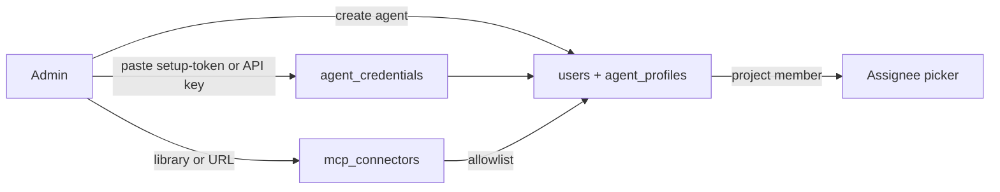

# AI Agent Employees - Plan

## Goal Capsule

- **Objective:** Let a workspace add an AI agent as a team member, assign it tasks like any other assignee, and have the platform run Claude Code against the task until a pull request is ready for human review.
- **Product authority:** This plan owns agent identity, provider credentials, the workspace MCP connector library, run dispatch and the task feedback loop. It does not change how humans work with tasks, git links, or permissions.
- **Execution profile:** Implement additively on a feature branch with database, API, worker, Docker image, web, and documentation parity. Claude Code is the only runtime that executes; Codex is registered but shown as coming soon.
- **Stop conditions:** Stop before merging pull requests on the agent's behalf, before shipping any shared "workspace subscription" credential, before executing arbitrary stdio commands supplied by users, and before any change that lets an agent act outside its role and project membership.
- **Open blockers:** None.
- **Tail ownership:** The implementation workflow owns tests, simplification, code review, and local commits; it must not push or open a PR without a later user request.

---

## Product Contract

### Summary

An agent is a user with `actor_type = 'agent'`, a runtime, a provider credential, and a set of allowed MCP connectors. Assigning a task to it queues a run. A worker inside the ordi deployment clones the project's repository, launches Claude Code headless with the ordi MCP server and the agent's connectors, streams the log to the task page, and ends with a pull request and the task in review. Humans review and merge; the existing `pr_merged` git rule closes the task. Comments on the task continue the same Claude session.

### Problem Frame

ordi already says "agent-first": every human action is reachable over MCP within a token's scope, and the seed even ships an `Agent` user. What is missing is the loop. Nothing turns `task.assigned` into work, nothing knows which model runs the agent or whose plan pays for it, nothing tells the agent which external tools it may use, and nothing shows a manager what the agent did and why. Today the answer is "open Claude Code on your laptop and point it at ordi", which does not scale past one person.

### Key Decisions

- **Agents run inside the ordi deployment, not on user machines** (session-settled: user-approved — chosen over a self-hosted runner each person installs: the platform owns execution so an admin configures it once and every member can assign work). Governs R12-R16, R30-R33.
- **Claude Code first, Codex registered as coming soon** (session-settled: user-approved — chosen over shipping both adapters: one runtime end to end beats two half-finished ones; the runtime enum, UI selector and credential model keep room for Codex). Governs R2, R6.
- **Subscriptions are first-class credentials alongside API keys** (session-settled: user-approved — chosen over API keys only: many teams already pay for Claude Max; Claude Code documents `claude setup-token` for headless use). Governs R6-R11.
- **A credential belongs to a person, not to the workspace** (session-settled: user-approved — chosen over a workspace-wide subscription: a Max plan is personal under Anthropic's terms, so the agent runs on a named member's plan or on a company API key, and the UI says whose limit it consumes). Governs R7, R9, R11.
- **A workspace connector library with a per-agent allowlist** (session-settled: user-approved — chosen over ad-hoc MCP config per run: admins add connectors once, from a curated library or by URL, and grant them to specific agents). Governs R17-R24.
- **The agent never closes a coding task itself** (session-settled: user-approved — chosen over letting the agent set Done: it leaves the task in an `in_review` status with a PR link; the existing `pr_merged` automation closes it after a human merges). Governs R28, R29.
- **Permissions stay role ∩ token scope plus project membership** (session-settled: reused from PRD §4 and §16 — no new permission model for agents). Governs R3, R14, R34.

### Actors

- **Workspace admin:** connects provider credentials, curates MCP connectors, creates agents and grants them connectors and projects.
- **Task author / reviewer:** assigns tasks to an agent, answers its questions in comments, reviews and merges the pull request.
- **Agent:** an `actor_type = 'agent'` user; reads and writes ordi through MCP with its own short-lived token, and edits code in a per-run checkout.
- **Agent worker:** the platform process that claims queued runs, prepares the workspace, launches Claude Code, streams events, and finalizes the run.
- **System:** outbox, notifications, git webhooks and status automations that already exist.

### Requirements

**Agent identity**

- R1. A workspace member with `users.manage` can create an agent from the same "Add member" dialog as a person by switching on "This is an AI agent". The agent is a `users` row with `actor_type = 'agent'`, no password, no invite email, and an `agent_profiles` row.
- R2. An agent profile has a runtime (`claude_code` executable now; `codex` visible in the selector, disabled, labelled coming soon), free-text instructions, a completion status category (`in_review` by default), `max_run_minutes`, `max_turns`, `max_budget_usd` (nullable), and `concurrency` (default 1).
- R3. An agent holds a role like any user and must be a project member to be assignable there; the assignee picker only offers agents that are members of the task's project.
- R4. Agents carry a visible badge wherever an avatar is rendered, and `GET /users/lookup` exposes `actorType` so the web app can render it.
- R5. Agents never appear in the People directory, leave, or compensation surfaces (existing behaviour, kept).

**Credentials**

- R6. `agent_credentials` stores provider (`anthropic` now; `openai` reserved), kind (`api_key` or `subscription`), label, `owner_user_id`, an AES-GCM encrypted secret, `expires_at`, `last_verified_at`, and status.
- R7. A subscription credential for Claude is the one-year OAuth token produced by `claude setup-token`; the user runs the command on their own machine and pastes the token into ordi. ordi never asks for claude.ai login itself.
- R8. An API-key credential for Claude is an Anthropic API key. `ANTHROPIC_API_KEY` in the container env is offered as a fallback source only for API keys, never for subscriptions.
- R9. Each agent profile references one primary credential and optionally one fallback credential. Deactivating the owner revokes their credentials; affected agents show "credential required" and stop being dispatched.
- R10. "Verify" runs a minimal headless Claude Code call with the credential and records `last_verified_at` or the error.
- R11. ordi notifies the owner fourteen days before a subscription token expires and marks the credential expired afterwards.

**Dispatch and runs**

- R12. When `task.assigned` names an enabled agent with a usable credential, a new `agents` outbox consumer inserts an `agent_runs` row (`queued`, trigger `assigned`) and posts a comment from the agent acknowledging the task. `bulkUpdateTasks` must emit `task.assigned` so bulk assignment also dispatches.
- R13. At most one active run exists per task; a second assignment or comment while a run is active is coalesced into a follow-up after the run ends.
- R14. The agent worker is a worker inside the API process, enabled by `AGENT_WORKER_ENABLED` (default on). It claims runs with `FOR UPDATE SKIP LOCKED`, respects `AGENT_WORKER_CONCURRENCY` and per-agent `concurrency`, and writes a heartbeat so the UI can show worker status.
- R15. The Docker image bundles `git` and the Claude Code CLI; the image build fails if `claude --version` does not run.
- R16. A run that no worker claims within ten minutes notifies the task author; a run that exceeds `max_run_minutes` is killed and marked `failed` with the reason.

**Connectors**

- R17. `mcp_connectors` stores workspace-level MCP servers: name, slug, source (`library` or `custom`), transport (`http`, `sse`, `stdio`), url or command/args, encrypted headers and env, `library_key`, enabled flag, health fields, and a cached tool list.
- R18. `packages/shared` ships a curated `MCP_LIBRARY` catalogue (key, name, description, transport, url or pinned npm command, required secret fields, docs link). The first catalogue covers GitHub, Context7, Playwright, Sentry, Notion, Linear, Slack, Figma, and PostgreSQL; entries are data, not code.
- R19. An admin with `integrations.manage` adds a connector from the library (filling its required secrets) or by URL for HTTP/SSE servers with optional bearer or header auth. Custom `stdio` connectors are not accepted in this slice.
- R20. "Test" performs an MCP initialize plus `tools/list` against the connector, stores the tool names and count, and shows them on the connector card.
- R21. `agent_connectors` links agents to connectors; the agent profile shows the workspace connectors as a checklist. The built-in `ordi` connector is always present and cannot be unchecked.
- R22. At run time the worker writes a per-run MCP config containing `ordi` plus the agent's allowed connectors with decrypted secrets, launches Claude Code with `--strict-mcp-config`, and deletes the file when the run ends.
- R23. Connectors are never exposed to the model as plain secrets in prompts or logs; run logs are scrubbed for header and env values before storage.
- R24. Disabling or deleting a connector removes it from future runs immediately; active runs finish with what they loaded.

**Task loop**

- R25. The run prompt contains the task ref, title, description as text, labels, comments so far, links and git links, the project key, the agent's instructions, and the rules of engagement: report progress with `comment_on_task`, attach the pull request with `add_task_link`, finish by moving the task to the configured completion category, and ask via comment when blocked.
- R26. The worker resolves the repository through `project_repositories`, clones it fresh into `/data/agent-work/<runId>` using the GitHub App installation token, checks out the branch from `GET /tasks/:id/branch-name`, and gives Claude Code the checkout as its working directory. Projects without a repository run in an empty scratch directory.
- R27. The worker mints a short-lived `api_tokens` row for the agent user at run start and revokes it at run end; the ordi MCP entry points at the local API with that token, so every write is attributed to the agent with `actor_type = 'agent'`.
- R28. On success the agent pushes its branch and opens a pull request with the installation token; the existing git webhook links the PR to the task, and the run records the PR url and a summary.
- R29. The agent moves the task to the project's status with the profile's completion category (`in_review` by default) and never to a `done` status in this slice.
- R30. A human comment on a task whose assignee is an agent, or an `@`-mention of the agent, queues a follow-up run (trigger `comment`) that resumes the previous Claude session with `--resume` and the new comment as the prompt.
- R31. A run that ends because Claude asked a question is marked `needs_input`; the question is a task comment, and the author is notified.
- R32. A run that fails on a provider rate limit is marked `waiting_quota`, retried when the window is expected to reset, and switched to the fallback credential when one is configured.
- R33. Run events are stored as they stream and broadcast over SSE so the task page shows a live log, duration, turn count, and cost or token usage when the CLI reports it.

**Security**

- R34. The child Claude Code process receives a rebuilt environment: `PATH`, `HOME` pointing at a per-run `CLAUDE_CONFIG_DIR`, the provider credential, MCP timeouts, and nothing else. `DATABASE_URL`, `ENCRYPTION_KEY`, `AUTH_SECRET`, S3 and SMTP settings never reach it.
- R35. The run is launched with `--permission-mode bypassPermissions --permission-prompts none --max-turns <n>` and, for API-key credentials, `--max-budget-usd <n>`; the plan documents the blast radius as the container plus the agent's ordi role plus repository write via the installation token.
- R36. `docker-compose.prod.yml` documents an optional split where the worker runs as its own service from the same image with `AGENT_WORKER_ENABLED=1` and the API with `0`; the split is documentation in this slice, not default.
- R37. The GitHub App manifest requests `contents: write` and `pull_requests: write`; the integrations panel explains that the org owner must accept the new permissions before agents can push.

### Key Flows




### Acceptance Examples

- **AE1 — Create an agent:** Given an admin in Settings → Users, when they add a member with "This is an AI agent", runtime Claude Code, and a credential, then a badged agent appears in the user list, has no password, is absent from People, and can be added to a project.
- **AE2 — Subscription credential:** Given a member who ran `claude setup-token`, when they paste the token and click Verify, then the credential shows verified with an expiry a year out, and an agent bound to it can be dispatched.
- **AE3 — Dispatch:** Given a task in a project with a linked repository, when it is assigned to the agent, then within seconds the task shows an acknowledgement comment and a queued run, and the worker starts it.
- **AE4 — Pull request:** Given a running agent that finishes a fix, when the run completes, then the task has a git link to an open PR, sits in an `in_review` status, and the run card shows a summary and usage.
- **AE5 — Merge closes:** Given AE4, when a human merges the PR, then the existing automation moves the task to Done with `actor_type = 'integration'`, and the run stays untouched.
- **AE6 — Follow-up:** Given a task in review with an agent assignee, when the reviewer comments "also update the tests", then a follow-up run resumes the same session and pushes to the same branch.
- **AE7 — Connector allowlist:** Given a workspace with GitHub and Sentry connectors and an agent allowed only Sentry, when the agent runs, then the MCP config contains `ordi` and `sentry` only, and the log never contains the Sentry token.
- **AE8 — Quota:** Given an agent on a subscription credential that hits its five-hour window, when the CLI reports the limit, then the run shows `waiting_quota`, switches to the fallback API key if configured, and otherwise retries later without spamming the author.
- **AE9 — Bulk assign:** Given three tasks selected in the list view, when they are bulk-assigned to the agent, then three runs are queued (serialised by the agent's concurrency).
- **AE10 — Codex placeholder:** Given the runtime selector, when the admin opens it, then Codex is visible, disabled, and labelled coming soon, and the API rejects `codex` with a validation error.

### Success Criteria

- A workspace can go from "no agent" to a merged agent PR using only Settings, the Add member dialog, and the assignee picker.
- Every agent action inside ordi is attributable in the activity log to the agent user.
- A manager can tell whose plan an agent consumes and how much each run cost or used.
- Admins can add a connector from the library in under a minute and see which tools it exposes before granting it.
- No provider or connector secret appears in run logs, task comments, or API responses.

### Scope Boundaries

**Deferred for later**

- Codex runtime execution (device-auth flow driven from the UI, `CODEX_HOME` persistence, `codex exec resume`).
- Cloud-hosted runtimes (Anthropic Managed Agents, Codex cloud) and a desktop-embedded runner.
- Agents that complete non-code tasks straight to a `done` status; this slice always stops at `in_review`.
- Tool-level allowlists inside a connector (`mcp__server__tool` granularity); this slice grants whole connectors.
- Custom `stdio` connectors and OAuth-authenticated remote MCP servers that need an interactive login.
- Scheduled or recurring agent runs, and agents as reviewers of other agents' PRs.
- GitLab and Gitea checkouts (the credential plumbing exists; only GitHub App cloning is wired here).
- Running the worker as a separate container by default; this slice documents the split.

**Explicitly out of scope**

- Merging pull requests, deleting branches, or any irreversible git action by the agent.
- Sharing one subscription credential across the workspace, or ordi initiating a claude.ai login flow.

### Dependencies / Assumptions

- Claude Code headless mode supports `--mcp-config`, `--strict-mcp-config`, `--permission-mode`, `--permission-prompts none`, `--max-turns`, `--max-budget-usd`, `--output-format stream-json`, `--resume`, `--append-system-prompt`, and honours `CLAUDE_CODE_OAUTH_TOKEN` (not in `--bare` mode). Verified against the CLI reference on 2026-09-05.
- The GitHub App integration can mint installation tokens (`installationToken` in `integrations/github-app.ts`) and receives PR webhooks that populate `git_links`.
- The outbox relay, `email_deliveries` claim pattern, and SSE broadcaster are the reference implementations for dispatch, claiming, and live logs.
- The Node 22 slim base image can install the Claude Code CLI and `git` without extra runtimes.

### Sources / Research

- [Claude Code authentication and `setup-token`](https://code.claude.com/docs/en/authentication.md)
- [Claude Code headless usage](https://code.claude.com/docs/en/headless.md)
- [Claude Code CLI reference](https://code.claude.com/docs/en/cli-reference.md)
- [Claude Code MCP configuration](https://code.claude.com/docs/en/mcp.md)
- [Codex authentication (deferred runtime)](https://learn.chatgpt.com/docs/auth.md)
- [Codex non-interactive mode (deferred runtime)](https://learn.chatgpt.com/docs/non-interactive-mode)
- PRD §3.3 (outbox), §4 (RBAC), §13 (git), §16 (MCP); `docs/architecture-decisions.md` §5 (events and workers).

---

## Planning Contract

### Key Technical Decisions

- KTD1. Keep `users.actor_type = 'agent'` as the identity flag and add `agent_profiles` (1:1), `agent_credentials`, `mcp_connectors`, `agent_connectors`, `agent_runs`, and `agent_run_events` as additive tables. Governs R1-R2, R6, R17, R21, R33.
- KTD2. Dispatch through a sixth outbox consumer named `agents` so queuing inherits retry, dedupe, and dead-letter behaviour; the worker claims with `FOR UPDATE SKIP LOCKED` exactly like `email_deliveries`. Governs R12-R14.
- KTD3. Model runtimes as adapters behind one interface (`prepare`, `start`, `resume`, `parseEvent`, `classifyFailure`); ship `claude-code.ts` and a `codex.ts` stub that throws `runtime_unavailable`. Governs R2, R30, R32.
- KTD4. Per-run identity is a minted-and-revoked `api_tokens` row, never a stored long-lived token; the ordi MCP entry targets `http://localhost:<port>/api/v1/mcp` with that bearer. Governs R27.
- KTD5. Secrets (credential secrets, connector headers and env) are AES-GCM blobs via `lib/crypto`, masked in every GET, and only decrypted inside the worker when writing the per-run config. Governs R6, R17, R23, R34.
- KTD6. Connector library entries live in `packages/shared/src/mcp-library.ts` as typed data; the API validates custom connectors to `http`/`sse` only. Governs R18, R19.
- KTD7. Run events are rows, not files: `agent_run_events` with a sequence number, broadcast through the existing SSE broadcaster scoped to the task's project. Governs R33.
- KTD8. The completion status is resolved per project by category (`in_review`), falling back to the first non-done status when the project has none, and the agent never targets `done`. Governs R29.

### High-Level Technical Design

```mermaid
flowchart LR
  UI[Settings: Agents / Credentials / Connectors] --> API[/api/v1/agents/*]
  Assign[PATCH /tasks/:id assigneeIds] --> Outbox[(events)]
  Outbox --> Consumer[agents consumer]
  Consumer --> Runs[(agent_runs)]
  Runs --> Worker[agent worker]
  Worker --> Git[GitHub App clone/push/PR]
  Worker --> Claude[claude -p]
  Claude --> OrdiMCP[/api/v1/mcp with per-run token]
  Claude --> Connectors[allowed MCP connectors]
  Worker --> Events[(agent_run_events)] --> SSE[/api/v1/stream]
  Git --> Webhook[git webhook] --> Links[(git_links)] --> Rule[pr_merged rule]
```

The API gains an `agents` domain under `apps/api/src/domains/agents/` with routes for profiles, credentials, connectors, and runs. The worker lives in `apps/api/src/workers/agent-runs.ts` and is started from `workers/index.ts`. The Claude adapter builds the command below, with `CLAUDE_CONFIG_DIR` set to a per-run directory that holds the MCP config and nothing else:

```
claude -p "<prompt>" \
  --output-format stream-json --verbose \
  --mcp-config <run-dir>/mcp.json --strict-mcp-config \
  --permission-mode bypassPermissions --permission-prompts none \
  --max-turns <profile.max_turns> [--max-budget-usd <profile.max_budget_usd>] \
  --append-system-prompt "<rules of engagement>" [--resume <session_id>]
```

### State and Compatibility Rules

- Run statuses are `queued`, `claimed`, `running`, `waiting_quota`, `needs_input`, `succeeded`, `failed`, and `cancelled`. Only `queued` runs are claimable; only `running` runs can be cancelled by a user.
- Run triggers are `assigned`, `comment`, `retry`, and `manual`.
- Credential statuses are `active`, `expired`, and `revoked`; only `active` credentials are dispatchable.
- Connector sources are `library` and `custom`; transports `http`, `sse`, and `stdio` (stdio only when `source = 'library'`).
- Existing `task.assigned` payloads are unchanged; the consumer reads `assigneeIds` and looks up actor types itself.
- Existing agent user from the seed keeps working: without an `agent_profiles` row it is simply never dispatched.
- Existing MCP tokens, OAuth clients, and the McpPanel remain as they are; agents use the same hosted endpoint.

### System-Wide Impact

- **Database:** six additive tables, `users` unchanged, one forward migration.
- **API:** new `agents` domain; `bulkUpdateTasks` emits `task.assigned`; `GET /users/lookup` returns `actorType`; GitHub App manifest asks for write scopes.
- **Workers:** new `agents` consumer and `agent-runs` worker with heartbeat; `startWorkers` and `stopWorkers` wire them.
- **Docker:** `Dockerfile.api` installs `git` and the Claude Code CLI; a `/data/agent-work` volume is documented; prod compose documents the optional split.
- **Web:** Add member dialog toggle, Settings → Agents panel with Agents, Credentials, and Connectors tabs, avatar badge, task page run block, i18n in English and Ukrainian.
- **Shared:** Zod schemas for agents, credentials, connectors, and runs; `MCP_LIBRARY`; new permission `agents.manage`; new event types `agent.run_queued`, `agent.run_started`, `agent.run_finished`, `agent.needs_input`.
- **Docs:** PRD §16 addendum, architecture decision on platform-hosted agents, deployment notes for the image and volume.

### Risks and Mitigations

- **Blast radius of bypassPermissions:** rebuilt child env, per-run token, no `done` transitions, no merge; documented container split for production.
- **Provider terms:** credentials are per person, never shared workspace-wide; the UI states whose plan is consumed; ordi never initiates claude.ai login.
- **Rate limits on subscriptions:** `waiting_quota` state with backoff and optional fallback credential.
- **Disk growth:** fresh clone per run plus deletion on finish; volume size documented in operations.
- **Secrets in logs:** scrub known secret values from every stored event before insert.
- **Duplicate runs:** unique partial index on `agent_runs(task_id) WHERE status IN ('queued','claimed','running','waiting_quota')`.
- **Bulk assignment silently ignored:** `bulkUpdateTasks` gains event emission with a regression test.
- **GitHub App permission bump:** the integrations panel shows a "re-accept permissions" state until the installation reports write scopes.

### Sequencing

Persist and share contracts first, then credentials and connectors (they are independent of dispatch), then the consumer and worker with the Claude adapter, then web surfaces, then Docker and docs. End-to-end verification with a seeded project and a real credential closes the work.

---

## Implementation Units

### U1. Add the agent data model and shared contracts

- **Goal:** Establish additive persistence and validated input shapes for agents, credentials, connectors, and runs.
- **Requirements:** R1, R2, R6, R17, R21, R33.
- **Dependencies:** None.
- **Files:** `packages/db/src/schema/agents.ts`, `packages/db/src/schema/index.ts`, `packages/db/drizzle/*`, `packages/shared/src/schemas/agents.ts`, `packages/shared/src/mcp-library.ts`, `packages/shared/src/permissions.ts`, `packages/shared/src/events.ts`, `packages/shared/src/index.ts`.
- **Approach:** Add `agent_profiles`, `agent_credentials`, `mcp_connectors`, `agent_connectors`, `agent_runs`, `agent_run_events` with the partial unique index on active runs; add the `agents.manage` permission and the four event types; define the library catalogue and Zod schemas with `runtime: z.enum(['claude_code'])` and a documented `codex` reservation.
- **Test scenarios:** Migration is additive; schemas reject `codex`, custom `stdio`, and missing credential owners; library entries validate against their own schema.
- **Verification:** `pnpm --filter @ordi/db typecheck && pnpm --filter @ordi/shared typecheck`.

### U2. Implement credentials and connectors APIs

- **Goal:** Let admins store and test provider credentials and MCP connectors without any dispatch yet.
- **Requirements:** R6-R11, R17-R21, R23, R24.
- **Dependencies:** U1.
- **Files:** `apps/api/src/domains/agents/credentials.ts`, `apps/api/src/domains/agents/connectors.ts`, `apps/api/src/domains/agents/routes.ts`, `apps/api/src/app.ts`, `apps/api/src/lib/crypto.ts`, `apps/api/src/test/agents-credentials.test.ts`.
- **Approach:** CRUD with encrypted secrets and masked responses; `POST /agent-credentials/:id/verify` runs a minimal headless call through the Claude adapter; `POST /mcp-connectors/:id/test` performs initialize plus `tools/list` with the MCP SDK client and caches tool names; owner deactivation revokes credentials; expiry reminder job in `workers/scheduled.ts`.
- **Test scenarios:** Secrets never appear in GET bodies; verify and test record outcomes; revoked credentials are not listed as usable; custom stdio is rejected.
- **Verification:** `pnpm --filter @ordi/api test -- agents-credentials.test.ts`.

### U3. Implement agent profiles and the assignment surface

- **Goal:** Create agents from the member dialog and make them assignable within their projects.
- **Requirements:** R1-R5, R9.
- **Dependencies:** U1, U2.
- **Files:** `apps/api/src/domains/agents/profiles.ts`, `apps/api/src/domains/core/users.routes.ts`, `apps/api/src/domains/projects/service.ts`, `apps/api/src/test/agents-profiles.test.ts`.
- **Approach:** `POST /agents` creates the user with `actor_type = 'agent'` and its profile in one transaction; `GET /users/lookup` returns `actorType`; assignee validation in `updateTask`/`createTask` rejects agents that are not project members; `bulkUpdateTasks` emits `task.assigned` for newly added assignees.
- **Test scenarios:** Agent creation without email invite; password reset refused; bulk assignment emits events; a non-member agent is rejected as assignee.
- **Verification:** `pnpm --filter @ordi/api test -- agents-profiles.test.ts projects.test.ts`.

### U4. Implement dispatch, the worker, and the Claude Code adapter

- **Goal:** Turn an assignment into a finished run with a pull request.
- **Requirements:** R12-R16, R22, R25-R35.
- **Dependencies:** U1-U3.
- **Files:** `apps/api/src/workers/consumers.ts`, `apps/api/src/workers/agent-runs.ts`, `apps/api/src/workers/index.ts`, `apps/api/src/domains/agents/runtime/types.ts`, `apps/api/src/domains/agents/runtime/claude-code.ts`, `apps/api/src/domains/agents/runtime/codex.ts`, `apps/api/src/domains/agents/runs.ts`, `apps/api/src/domains/agents/prompt.ts`, `apps/api/src/domains/agents/workspace.ts`, `apps/api/src/domains/integrations/github-app.ts`, `apps/api/src/test/agents-dispatch.test.ts`, `apps/api/src/test/agents-runtime.test.ts`.
- **Approach:** The `agents` consumer queues runs and posts the acknowledgement comment; the worker claims, mints the token, clones with the installation token, writes `mcp.json` from `ordi` plus allowed connectors, spawns the CLI with the rebuilt env, parses `stream-json` into events (capturing `session_id`, usage, result), classifies failures (rate limit → `waiting_quota`, question → `needs_input`), pushes the branch, opens the PR, revokes the token, deletes the workdir. Comment and mention events queue follow-ups with `--resume`. The adapter is tested against a fake `claude` binary on `PATH`.
- **Test scenarios:** Dispatch on assignment and bulk assignment; no duplicate active runs; env scrubbing; MCP config contains exactly the allowed connectors; rate-limit output yields `waiting_quota` and fallback; timeout kills and fails; follow-up passes `--resume`; secrets scrubbed from stored events.
- **Verification:** `pnpm --filter @ordi/api test -- agents-dispatch.test.ts agents-runtime.test.ts`.

### U5. Build the web surfaces

- **Goal:** Give admins and task authors the screens the flow needs.
- **Requirements:** R1, R2, R4, R7, R10, R19-R21, R31, R33, R37.
- **Dependencies:** U2-U4.
- **Files:** `apps/web/src/pages/Settings.tsx`, `apps/web/src/components/settings/AgentsPanel.tsx`, `apps/web/src/components/settings/AgentCredentialsPanel.tsx`, `apps/web/src/components/settings/McpConnectorsPanel.tsx`, `apps/web/src/components/settings/IntegrationsPanel.tsx`, `apps/web/src/components/task/AgentRunsBlock.tsx`, `apps/web/src/pages/TaskPage.tsx`, `apps/web/src/components/ui.tsx`, `apps/web/src/components/task/PropertySidebar.tsx`, `apps/web/src/lib/queries.ts`, `apps/web/src/lib/sse.ts`, i18n dictionaries.
- **Approach:** Add member dialog gains the agent toggle, runtime selector (Codex disabled with a coming-soon badge), credential picker, and connector checklist; Settings → Agents lists agents, worker status, credentials, and connectors with library picker and URL form; `Avatar` renders the badge from `actorType`; the task page shows runs with a live log, retry and cancel; the integrations panel shows the GitHub App permission re-accept state.
- **Test scenarios:** Typecheck and build; query shapes registered; both locales; an e2e smoke that creates an agent and sees it in the assignee picker.
- **Verification:** `pnpm --filter @ordi/web typecheck && pnpm --filter @ordi/web build && pnpm check:query-shapes`.

### U6. Package the runtime and document the deployment

- **Goal:** Make `docker compose up` produce a working agent worker.
- **Requirements:** R15, R36, R37.
- **Dependencies:** U4.
- **Files:** `docker/Dockerfile.api`, `docker-compose.yml`, `docker-compose.prod.yml`, `docs/deployment.md`, `docs/operations.md`, `docs/prd.md`, `docs/architecture-decisions.md`, `docs/features.md`, `.github/workflows/ci.yml`.
- **Approach:** Install `git` and the Claude Code CLI in the image with a build-time version check; add the `/data/agent-work` volume and `AGENT_WORKER_*` env vars; document the optional worker split and the GitHub App permission bump; record the platform-hosted-agents decision and the credential ownership rule.
- **Test scenarios:** CI boots the image and runs `claude --version`; compose files validate.
- **Verification:** `docker build -f docker/Dockerfile.api .` and the existing CI image boot step.

### U7. Verify the product slice end to end

- **Goal:** Prove the loop with a seeded project and a real credential, then close the tail.
- **Requirements:** All.
- **Dependencies:** U1-U6.
- **Files:** `apps/api/src/seed.ts`, `apps/web/e2e/*`, this plan.
- **Approach:** Seed the demo agent with a profile bound to a placeholder credential; walk AE1-AE10 manually against a throwaway repository; run the simplification and code-review skills; record residual risks in the architecture decisions log.
- **Test scenarios:** AE1-AE10 observed.
- **Verification:** Repository gates below plus the behavioural smoke test.

---

## Verification Contract

- **Focused database/contracts:** `pnpm --filter @ordi/db typecheck && pnpm --filter @ordi/shared typecheck`.
- **Focused API:** `pnpm --filter @ordi/api test -- agents-credentials.test.ts agents-profiles.test.ts agents-dispatch.test.ts agents-runtime.test.ts projects.test.ts`.
- **Focused MCP:** `pnpm --filter @ordi/mcp test` (the hosted endpoint is reused unchanged).
- **Web:** `pnpm --filter @ordi/web typecheck && pnpm --filter @ordi/web build`.
- **Repository gates:** `pnpm typecheck`, `pnpm test`, `pnpm build`, `pnpm check:query-shapes`, and `pnpm check:desktop-safe`.
- **Image:** `docker build -f docker/Dockerfile.api .` succeeds and `claude --version` runs inside it.
- **Migration review:** inspect the generated SQL for additive tables and indexes only.
- **Behavioral smoke test:** create an agent on a subscription credential, grant one library connector, assign a small fix in a project with a linked repository, watch the live log, review the PR, merge it, confirm the task closes, then comment and confirm a follow-up run resumes the session.
- **Quality tail:** run the repository simplification and code-review skills; fix eligible findings and record any residual risk.

---

## Definition of Done

- Every R-ID is implemented or explicitly deferred by its owning scope boundary.
- Every U-ID has an observed verification result.
- Existing users, tasks, git links, MCP tokens, and OAuth clients remain readable and functional.
- Dispatch, run lifecycle, credential handling, connector allowlists, and env scrubbing have API integration coverage.
- Settings, the member dialog, the assignee picker, and the task page form one coherent English/Ukrainian workflow.
- No secret appears in any API response, stored run event, or task comment.
- The Docker image runs the worker out of the box and the production split is documented.
- Required repository gates pass, or an external environment failure is documented with focused checks still passing.
- Simplification and code review are complete, eligible findings are resolved, and abandoned experimental code is removed from the diff.
